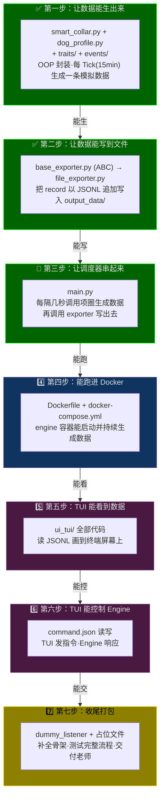
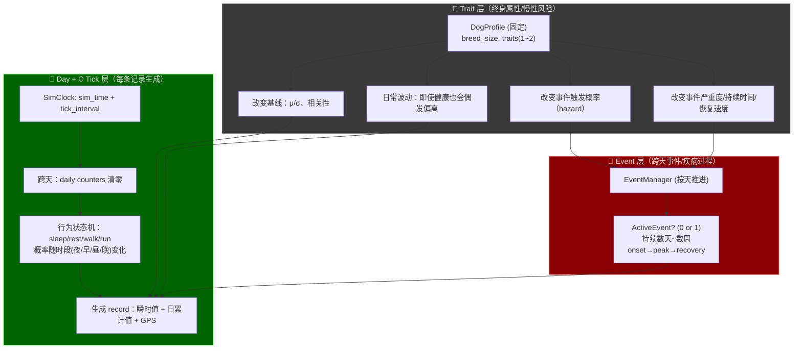
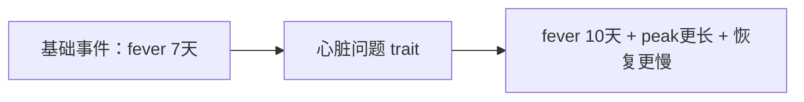
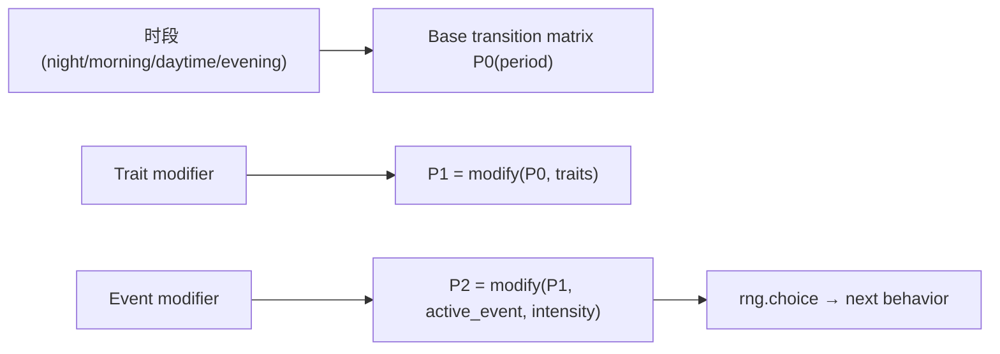

# C端狗项圈数据生成器

---

这是我们小组的狗项圈数据生成器，主要会生成一些数据，来模拟狗项圈检测到的

## 架构设计

我们考虑的**架构** 是:
```
C_end_Simulator/                        <-- 第一阶段大目录 (在总项目的 Git 管理下)
│
├── .gitignore                          <-- 忽略 venv、__pycache__、.idea 等
├── docker-compose.yml                  <-- 新增：编排容器
├── README.md                           <-- 描述本仓库
│
├── output_data/
│   ├── command.json                    <-- 【新增：控制总线】TUI 往这里写指令(如开启/停止)，Engine 从这里读指令
│   ├── realtime_stream.jsonl           <-- ✅【给 UI 看的】实时热数据（FileExporter 追加写入 JSONL）
│   ├── engine_status.json              <-- 【状态机】记录 Docker 引擎的死活、当前网络状态
│   │
│   ├── offline_cache/                  <-- 【断网急救包】积压的未发送数据
│   │   ├── .gitkeep
│   │   └── pending_1700001.json        <-- 网络断开时，堆积在这里的数据块
│   │
│   └── audit_logs/                     <-- 【黑匣子】历史对账审计日志
│       ├── .gitkeep
│       ├── log_20231024.log            <-- 按天滚动的历史文件
│       └── log_20231025.log
│
├── engine/                             <-- 【核心一：打工人 (放进 Docker)】
│   ├── Dockerfile                      <-- 镜像打包说明书
│   ├── main.py                         <-- 核心调度器 (解析参数、管理多线程与队列)
│   │
│   ├── models/                         <-- ✅ [业务模型层]
│   │   ├── __init__.py
│   │   ├── dog_profile.py              <-- ✅ 狗的长期属性 (DogProfile)
│   │   └── smart_collar.py             <-- ✅ 智能项圈类 (OOP 封装，产生模拟数据，默认 15min/tick)
│   │
│   ├── traits/                         <-- ✅ [特质层：慢性病/体质修正]
│   │   ├── __init__.py
│   │   ├── base_trait.py               <-- ✅ 特质抽象基类
│   │   ├── cardiac.py                  <-- ✅ CardiacRisk（心脏问题倾向）
│   │   ├── respiratory.py              <-- ✅ RespiratoryRisk（呼吸道问题倾向）
│   │   └── ortho.py                    <-- ✅ OrthoRisk（骨骼/关节问题倾向）
│   │
│   ├── events/                         <-- ✅ [事件层：疾病/受伤等长期事件]
│   │   ├── __init__.py
│   │   ├── base_event.py               <-- ✅ 事件抽象基类 + EventPhase
│   │   ├── event_manager.py            <-- ✅ EventManager（按天推进事件）
│   │   ├── fever.py                    <-- ✅ FeverEvent（发烧事件）
│   │   └── injury.py                   <-- ✅ InjuryEvent（受伤事件）
│   │
│   ├── exporters/                      <-- ✅ [数据输出层：策略模式]
│   │   ├── __init__.py
│   │   ├── base_exporter.py            <-- ✅ 定义通用发送接口 (BaseExporter ABC)
│   │   ├── file_exporter.py            <-- ✅ 写入 output_data/ 的 JSONL 文件 (FileExporter)
│   │   └── http_exporter.py            <-- 🔮 未来任务：发送给服务器 API (占位)
│   │
│   └── listeners/                      <-- [指令接收层：监听服务器]
│       ├── __init__.py
│       ├── base_listener.py            <-- 定义通用监听接口
│       ├── dummy_listener.py           <-- 本周任务：假装在监听 (控制台打印空转)
│       └── ws_listener.py              <-- 🔮 未来任务：WebSocket 接收控制指令 (占位)
│
├── tests/                              <-- ✅ [测试]
│   ├── __init__.py
│   ├── test_step1_data_generation.py   <-- ✅ Step 1 测试：数据生成
│   └── test_step2_file_exporter.py     <-- ✅ Step 2 测试：文件导出
│
├── ui_gui/                             <-- 【核心二：桌面图形界面 (外部 PyQt 运行)】
│   ├── __init__.py
│   ├── requirements.txt                <-- 依赖清单 (PyQt6)
│   ├── app.py                          <-- UI 启动总入口 (统筹登录窗和主界面的切换)
│   ├── login_window.py                 <-- 登录窗口类 (处理账号密码，生成 user_id)
│   └── main_window.py                  <-- 主控制台窗口类 (发号施令、定时读取日志刷新图表)
│
└── ui_tui/                            
    ├── Dockerfile                      <-- TUI 专属镜像
    ├── requirements.txt                <-- TUI 专属依赖
    ├── app.py                          <-- TUI 启动入口
    └── screens/
        ├── __init__.py
        ├── login_screen.py             <-- 终端登录屏骨架
        └── dashboard_screen.py         <-- 监控大屏骨架
    
```
## 数据流解析

```mermaid
flowchart TD
    subgraph FutureServer["☁️ 远程服务器 (S端) 🔮 未来阶段"]
        api["REST API<br/>接收数据上报"]
        ws_server["WebSocket Server<br/>下发控制指令"]
    end

    subgraph DockerEnv["🐳 Docker 环境 (打包给老师的部分)"]

        subgraph EngineContainer["engine/ 容器 (后台常驻)"]
            collar["engine/models/smart_collar.py<br/>智能项圈类<br/>OOP封装·产生模拟数据"]
            main["engine/main.py<br/>核心调度器<br/>解析参数·管理多线程与队列<br/>轮询读取 command.json"]

            subgraph Exporters["engine/exporters/ 数据输出层"]
                base_exp["base_exporter.py<br/>通用发送接口"]
                file_exp["✅ file_exporter.py<br/>写入 output_data/ JSONL<br/>【当前阶段·正在使用】"]
                http_exp["🔮 http_exporter.py<br/>发送给服务器 API<br/>【未来阶段·占位空壳】"]
                base_exp -.->|"继承"| file_exp
                base_exp -.->|"继承"| http_exp
            end

            subgraph Listeners["engine/listeners/ 指令接收层"]
                base_lis["base_listener.py<br/>通用监听接口"]
                dummy_lis["✅ dummy_listener.py<br/>假装在监听·控制台空转<br/>【当前阶段·正在使用】"]
                ws_lis["🔮 ws_listener.py<br/>WebSocket 接收指令<br/>【未来阶段·占位空壳】"]
                base_lis -.->|"继承"| dummy_lis
                base_lis -.->|"继承"| ws_lis
            end

            collar -->|"生成模拟数据"| main
            main -->|"调度输出"| file_exp
            main -->|"注册监听"| dummy_lis
            dummy_lis -->|"控制台打印空转<br/>(不连任何服务器)"| main
        end

        subgraph SharedVolume["📦 output_data/ (bind mount · /data/)"]
            cmd["command.json 🆕<br/>控制总线<br/>UI写指令 → Engine读指令"]
            stream["realtime_stream.jsonl<br/>实时热数据"]
            status["engine_status.json<br/>引擎状态机"]
            cache["offline_cache/<br/>断网急救包<br/>🔮 补发逻辑未来实现"]
            audit["audit_logs/<br/>黑匣子·按天滚动<br/>log_2023xxxx.log"]
        end

        subgraph TUIContainer["ui_tui/ 容器 (交互式·打包给老师)"]
            tui_app["ui_tui/app.py<br/>TUI 启动总入口"]
            login_scr["ui_tui/screens/login_screen.py<br/>极客风终端登录屏"]
            dash_scr["ui_tui/screens/dashboard_screen.py<br/>极客风实时数据监控大屏<br/>读取数据展示 + 写入指令控制"]
            tui_app --> login_scr
            login_scr -->|"登录成功"| dash_scr
        end

        %% ✅ 当前阶段：Engine 写数据
        file_exp -->|"✍️ 写入"| stream
        file_exp -->|"✍️ 写入"| status
        file_exp -->|"✍️ 写入"| audit

        %% ✅ 当前阶段：Engine 读指令
        cmd -->|"👀 轮询读取指令"| main

        %% ✅ 当前阶段：TUI 读数据
        stream -->|"👀 读取"| dash_scr
        status -->|"👀 读取"| dash_scr
        audit -->|"👀 读取"| dash_scr

        %% ✅ 当前阶段：TUI 写指令
        dash_scr -->|"✍️ 写指令<br/>(开始/停止/调频率)"| cmd
    end

    subgraph Host["🖥️ 宿主机 (不打包进 Docker)"]
        terminal["用户终端<br/>stdin / stdout"]

        subgraph GUIApp["ui_gui/ (PyQt6 原生运行·无法打包进Docker)"]
            gui_app["ui_gui/app.py<br/>UI启动总入口"]
            gui_login["ui_gui/login_window.py<br/>登录窗口类"]
            gui_main["ui_gui/main_window.py<br/>主控制台窗口类<br/>定时读取日志刷新图表"]
            gui_app --> gui_login
            gui_login -->|"登录成功"| gui_main
        end
    end

    %% ✅ 当前阶段：终端 TTY 交互
    terminal <-->|"TTY 交互<br/>docker compose run tui"| tui_app

    %% ✅ 当前阶段：GUI 读数据 + 写指令（宿主机直接访问 output_data/）
    stream -.->|"👀 读取"| gui_main
    status -.->|"👀 读取"| gui_main
    gui_main -.->|"✍️ 写指令"| cmd

    %% 🔮 未来阶段（虚线）
    main -.->|"🔮 未来：调度输出"| http_exp
    http_exp -.->|"🔮 未来：📤 上报数据<br/>POST /api/data"| api
    file_exp -.->|"🔮 未来：断网写入"| cache
    cache -.->|"🔮 未来：恢复后补发"| http_exp
    main -.->|"🔮 未来：注册监听"| ws_lis
    ws_server -.->|"🔮 未来：📩 下发指令<br/>WS 长连接"| ws_lis
    ws_lis -.->|"🔮 未来：指令→调度器"| main

    style FutureServer fill:#3a3a3a,stroke:#666,color:#999,stroke-dasharray: 5 5
    style DockerEnv fill:#1a1a2e,stroke:#16213e,color:#e0e0e0
    style EngineContainer fill:#0f3460,stroke:#533483,color:#e0e0e0
    style Exporters fill:#1a4a1a,stroke:#2d7a2d,color:#e0e0e0
    style Listeners fill:#4a3a1a,stroke:#7a6a2d,color:#e0e0e0
    style SharedVolume fill:#2d4a22,stroke:#3a5a2c,color:#e0e0e0
    style TUIContainer fill:#4a1942,stroke:#6a2c70,color:#e0e0e0
    style Host fill:#2c2c2c,stroke:#555,color:#e0e0e0
    style GUIApp fill:#1b3a4b,stroke:#2d6187,color:#e0e0e0
```


## 开发流程



## 代码核心逻辑，狗项圈模拟器

### 0,目标和约束

- Traits：固定不变；可叠加；每只狗最多 1~2 个
- 长期事件（疾病/受伤等）：按“天”触发/推进；可持续数天到数周
- 慢性病（Trait）需要有“日常波动”（即使没有事件也会出现偏离）
- Day 概念：日累计指标（如步数）在一天内只增不减，午夜清零
- GPS：连续值；变化速度取决于当前行为状态（sleeping 最慢，running 最快）
- 电量不考虑
- Tick：每一轮生成一条记录；默认 1 tick = 15 min（可通过 tick_interval 参数调整）

### 2,核心对象，dogprofile

DogProfile
- dog_id: str
- breed_size: small/medium/large
- age_stage: puppy/adult/senior   (可选)
- traits: set[Trait]
    - CardiacRisk (心脏问题倾向)
    - RespiratoryRisk (呼吸道问题倾向)
    - OrthoRisk (骨骼/关节问题倾向)
- baseline_modifiers:
    - heart_rate_mean_offset: +x
    - resp_rate_mean_offset: +y
    - temperature_mean_offset: +z
    - hr_variability_multiplier: *k
    - rr_variability_multiplier: *k
- event_hazard_multipliers:
    - fever: *1.2
    - cold: *1.5
    - heatstroke: *1.1
    - injury: *2.0 (骨骼问题更容易拉伤/跛行)
- event_severity_multipliers:
    - fever: severity *1.3, duration +2 days
    - injury: duration *2.0, steps_multiplier lower

### 3,三层系统，谁负责什么



### 数据分类

A) 瞬时值（per-tick instant）
- heart_rate（心率）
- resp_rate（呼吸频率）
- resting_heart_rate（静息心率：可作为派生指标/或在 resting/sleeping 时输出）
- sleep_state（睡眠状态：sleeping/resting/...）
- anomaly_flags（异常行为检测结果：由阈值/规则产生）

B) 日累计值（per-day cumulative; within-day monotonic）
- today_steps（今日累计步数）：一天内只增不减；跨天清零
  生成逻辑是 Δsteps（本 tick 新增步数）→ today_steps += Δsteps

C) 连续状态值（continuous; depends on previous tick）
- gps_lat/gps_lng：由上一个位置 + 偏移得到；偏移尺度由行为状态决定

D) 长期状态（跨天/跨周）
- traits（固定，不可改变）
- active_event（可能为 None 或某个事件）
- event_day_index / phase / intensity（事件过程）

### 事件触发概率

P(event | dog, day, context)
= base_rate(event, season, day_type)
  × trait_multiplier(dog.traits, event)
  × context_multiplier(behavior, weather, activity_load)

举例：

有 心脏问题倾向：

“静息心率异常/心律不齐事件”概率更高
高强度运动时触发概率更高（context 叠加）
有 呼吸道问题倾向：

“呼吸频率异常/喘息/夜间咳嗽事件”概率更高
睡眠时也可能出现异常呼吸（改变夜间分布）
有 骨骼问题倾向：

“受伤/跛行”更容易发生
行为层会表现为：跑步概率更低、GPS移动更少、Δsteps更小

心脏风险：μ_offset +10 bpm，σ_mult 1.2（波动更大）
呼吸道风险：resp μ_offset +4，sleeping 时也不至于太低
骨骼问题：不一定改心率，但会改 Δsteps 的均值（走得少）和 running 概率（更少跑）
（相关随机数必须符合Numpy随机数

trait会影响到，狗的康复时间



engine/models/
- dog_profile.py      # 生成每只狗的长期属性（traits）
- smart_collar.py     # 行为层 + 日累计 + GPS + 事件层（使用 profile）

engine/events/
- base_event.py       # 事件抽象（持续天数、强度曲线）
- fever.py, injury.py # 具体事件
- event_manager.py    # 每天触发/推进事件（受 traits 影响）

engine/traits/
- base_trait.py
- cardiac.py
- respiratory.py
- ortho.py

### 时间体系

- sim_time: datetime（模拟时间）
- tick_interval: timedelta（每 tick 推进多少模拟时间）
- 每次 generate_one_record()：sim_time += tick_interval

当 sim_time.date != current_day:
- current_day = sim_time.date
- today_steps = 0
- 触发“每天一次”的逻辑（EventManager.advance_day）

### 行为状态机



### 一天内的时间段分类

- night:    22:00-06:00
- morning:  06:00-09:00
- daytime:  09:00-18:00
- evening:  18:00-22:00

不同时间段会改变状态机各个状态之间转移的概率，比如evening的时候，睡觉的概率会更高

### Trait 如何修正行为概念

- RespiratoryRisk / CardiacRisk：提高 sleeping/resting 概率，降低 running 概率（幅度小）
- OrthoRisk：显著降低 running 概率，略降低 walking 概率
- ActiveEvent 在 peak 时：强力提高 sleeping/resting，running 几乎为 0
- 修正后要重新归一化（概率和=1）

### GPS 生成逻辑

每 tick 更新：
new_lat = lat + Δlat
new_lng = lng + Δlng

其中 Δlat/Δlng 的标准差 σ 取决于 behavior：

sleeping: σ = 0
resting:  σ = tiny（几乎不动，只有抖动）
walking:  σ = small
running:  σ = large

### Trait 对GPS 生成逻辑的修正

- OrthoRisk：walking/running 的 σ 下调（更少移动）
- Injury event peak：walking/running 的 σ ≈ 0（基本不动）

### 步数模型

Δsteps = f(behavior) + noise
today_steps += max(0, int(Δsteps))

noise是一个小幅度的高斯噪声，为了模拟随机性，可以对一些指标加上高斯噪音

### Trait/事件 对步数的影响

- OrthoRisk：Δsteps 的均值下降（走得少）
- ActiveEvent（发烧/感冒）：
  - onset：Δsteps × 0.8
  - peak： Δsteps × 0.3
  - recovery：Δsteps × 0.6 → 1.0
- Injury peak：Δsteps × 0.0~0.1

### 慢性病波动

Trait（慢性病）如何体现“日常波动”（你要求的点）
你说“慢性病日常波动也要加上”，这意味着：

即使没有 active_event，也会偶尔出现“偏离”
但这种偏离应当是低幅度、可持续一段时间（小时级/天级），而不是一条记录突然爆炸
我建议定型为两种机制同时存在：

基线偏移（永久）
例如 CardiacRisk：静息 HR 均值 +10，波动更大（σ×1.2）。

慢性波动（短周期的小 drift）
引入一个 TraitDrift（漂移项），按小时或按天缓慢变化：

TraitDrift规范
- 每个 trait 都可以贡献一个 drift 值：
  drift_hr(t), drift_rr(t)
- drift 不需要每 tick 重采样；可以“每小时更新一次”或“每 N ticks 更新一次”
- record 的瞬时值 = 行为基准 + trait基线偏移 + drift + event叠加 + 随机噪声

效果：

呼吸道问题：夜间 RR 偶尔偏高、持续几十分钟到几小时
心脏问题：静息 HR 偶尔持续偏快一段时间
骨骼问题：活动量长期偏低，不一定要“事件”才能看出来

### EventManager（按天推进事件，持续数周）
#### 事件触发（每天一次）
事件触发规则.txt
- 每天午夜（跨天时）调用 EventManager.advance_day()
- 若当前没有 active_event：
  - 计算每类事件的 hazard：base_hazard × trait_multiplier × (可选：季节/天气/近几天运动负荷)
  - 按 hazard 抽样，最多触发 1 个事件（避免多事件叠加太复杂）

#### 事件推进（每天一次）
事件推进规则.txt
- active_event.day_index += 1
- 根据 day_index / duration_days 判断 phase（onset/peak/recovery）
- intensity = intensity_curve(phase, within_phase_progress)
- 若 day_index >= duration_days：active_event = None（痊愈）

#### Trait 对事件“更容易发生、更难好”的定型方式
Trait影响事件的三种方式.txt
1) hazard_multiplier：更容易触发某些事件
2) duration_multiplier：同样事件持续更久（例如 ×1.3）
3) severity_multiplier：强度更强（加值更大、步数倍率更低）

### 每 Tick 生成 record 的“最终流水线”
（顺序很重要，避免 Bug）：

```Mermaid
flowchart TD
    A["Tick开始: generate_one_record()"] --> B["1) sim_time += tick_interval"]
    B --> C{"2) 跨天了吗？"}
    C -->|是| D["2.1) today_steps=0<br/>EventManager.advance_day()"]
    C -->|否| E["3) 计算 time_period(夜/早/昼/晚)"]
    D --> E
    E --> F["4) 行为状态转移：<br/>P0(period)→Trait修正→Event修正→choice()"]
    F --> G["5) 生成瞬时值基准(正态)：<br/>vital_base = N(μ_behavior, σ_behavior)"]
    G --> H["6) 加 Trait 基线偏移 + Trait drift（慢性波动）"]
    H --> I["7) 生成 Δsteps（由 behavior 决定）并做 Trait/Event 修正"]
    I --> J["8) today_steps += max(0, int(Δsteps))"]
    J --> K["9) 更新 GPS：上一位置 + Δpos(behavior) 再做 Trait/Event 修正"]
    K --> L["10) 加 Event 叠加效果（按天 intensity）到瞬时值上"]
    L --> M["11) clamp/修正边界；组装 record 输出"]
```

### 输出 record 的字段

record = {
    "device_id":    ,
    "timestamp":    ,
    "behavior":     ,
    "heart_rate":   ,
    "resp_rate":    ,
    "temperature":  ,
    "steps":        ,
    "battery":      ,
    "gps_lat":      ,
    "gps_lng":      ,
    "event":        ,
    "event_phase":  ,
}

