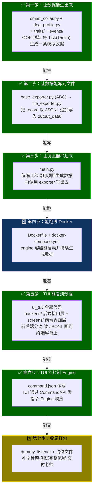
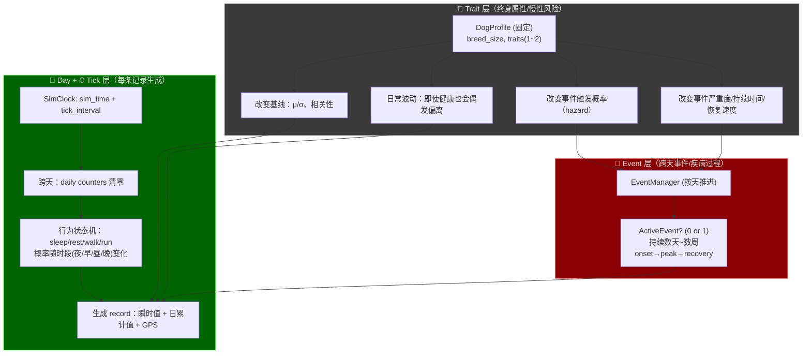
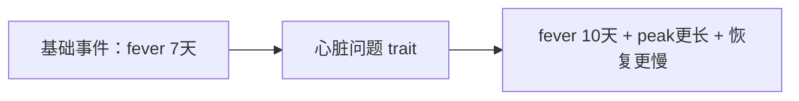
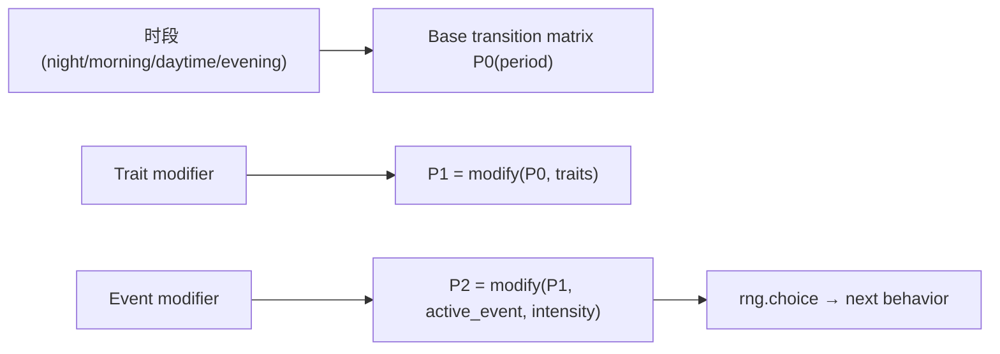
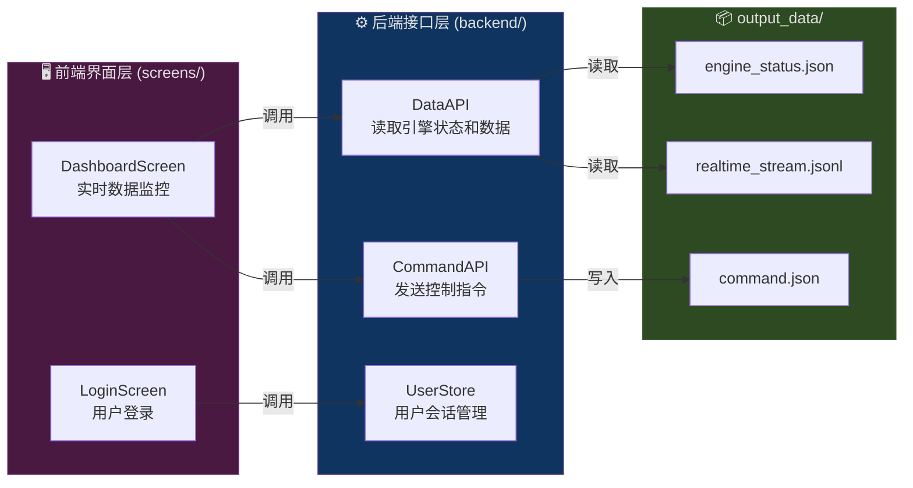

# C端狗项圈数据生成器

---

这是 PetNode 项目的 **C端（客户端）** 子系统——智能狗项圈数据模拟器。它负责模拟智能宠物项圈在真实场景中采集到的各类数据（心率、呼吸、体温、步数、GPS 等），并通过文件系统与 TUI/GUI 界面交互，实现数据展示和引擎控制。

## 架构设计

以下是完整的项目目录结构：
```
C_end_Simulator/                        <-- C端模拟器根目录（在总项目的 Git 管理下）
│
├── .gitignore                          <-- Git 忽略规则（venv、__pycache__、.idea、运行时数据文件等）
├── docker-compose.yml                  <-- Docker 编排配置（engine + tui 两个服务的定义与卷映射）
├── pytest.ini                          <-- pytest 测试框架配置（自定义 marker: docker）
├── README.md                           <-- 本文档
│
├── scripts/
│   └── docker_build_test.sh            <-- Docker 构建与验证脚本（自动化测试镜像构建和容器运行）
│
├── output_data/                        <-- 【数据交换目录】Engine、TUI、GUI 通过此目录通信
│   ├── command.json                    <-- 【控制总线】TUI/GUI 往这里写指令 → Engine 轮询读取并执行
│   ├── realtime_stream.jsonl           <-- 【实时热数据】Engine 追加写入的 JSONL 格式数据流（给 UI 看的）
│   ├── engine_status.json              <-- 【引擎状态】记录引擎的运行/停止状态和进度信息
│   │
│   ├── offline_cache/                  <-- 【断网急救包】🔮 未来阶段：网络断开时积压的未发送数据
│   │   └── .gitkeep
│   │
│   └── audit_logs/                     <-- 【黑匣子】🔮 未来阶段：按天滚动的历史审计日志
│       └── .gitkeep
│
├── engine/                             <-- 【核心引擎：数据模拟 + 调度 (打包进 Docker)】
│   ├── Dockerfile                      <-- Engine 容器镜像构建说明
│   ├── requirements.txt                <-- Engine 依赖清单（numpy）
│   ├── main.py                         <-- ✅ 核心调度器（解析参数、管理多线程、轮询 command.json）
│   │
│   ├── models/                         <-- ✅ [业务模型层]
│   │   ├── __init__.py
│   │   ├── dog_profile.py              <-- ✅ 狗的长期属性（DogProfile：体型、年龄、traits、GPS 基准）
│   │   └── smart_collar.py             <-- ✅ 智能项圈类（OOP 封装，每 tick 产生一条模拟数据记录）
│   │
│   ├── traits/                         <-- ✅ [特质层：慢性病/体质修正]
│   │   ├── __init__.py
│   │   ├── base_trait.py               <-- ✅ 特质抽象基类（5 组修正参数 + drift 慢性波动机制）
│   │   ├── cardiac.py                  <-- ✅ CardiacRisk（心脏问题倾向：HR+10, 波动×1.2）
│   │   ├── respiratory.py              <-- ✅ RespiratoryRisk（呼吸道问题倾向：RR+4, 波动×1.2）
│   │   └── ortho.py                    <-- ✅ OrthoRisk（骨骼/关节问题倾向：步数×0.75, 受伤概率×2）
│   │
│   ├── events/                         <-- ✅ [事件层：疾病/受伤等长期事件]
│   │   ├── __init__.py
│   │   ├── base_event.py               <-- ✅ 事件抽象基类 + EventPhase（onset → peak → recovery）
│   │   ├── event_manager.py            <-- ✅ EventManager（按天推进事件、按概率触发新事件）
│   │   ├── fever.py                    <-- ✅ FeverEvent（发烧事件：体温+1.5°C、心率+15bpm）
│   │   └── injury.py                   <-- ✅ InjuryEvent（受伤事件：步数≈0、GPS≈不动）
│   │
│   ├── exporters/                      <-- ✅ [数据输出层：策略模式]
│   │   ├── __init__.py
│   │   ├── base_exporter.py            <-- ✅ 数据导出器抽象基类（BaseExporter ABC）
│   │   ├── file_exporter.py            <-- ✅ 文件导出器（JSONL 追加写入 output_data/）
│   │   └── http_exporter.py            <-- 🔮 未来占位：HTTP 上报至远程服务器 API
│   │
│   └── listeners/                      <-- [指令接收层：监听服务器下发指令]
│       ├── __init__.py
│       ├── base_listener.py            <-- ✅ 指令监听器抽象基类（BaseListener ABC）
│       ├── dummy_listener.py           <-- ✅ 占位监听器（每次 poll() 返回 None，不连接任何服务器）
│       └── ws_listener.py              <-- 🔮 未来占位：WebSocket 接收远程控制指令
│
├── tests/                              <-- ✅ [测试套件：按开发步骤分层组织]
│   ├── __init__.py
│   ├── requirements.txt                <-- 测试依赖清单（pytest + numpy）
│   ├── test_step1_data_generation.py   <-- ✅ Step 1：数据生成测试（Profile/Traits/Events/SmartCollar）
│   ├── test_step2_file_exporter.py     <-- ✅ Step 2：文件导出测试（JSONL 写入与读取验证）
│   ├── test_step3_scheduler.py         <-- ✅ Step 3：调度器集成测试（main.run() 端到端）
│   ├── test_step4_docker_build.py      <-- ✅ Step 4：Docker 镜像构建测试（需 Docker 环境）
│   ├── test_step4_module_health.py     <-- ✅ Step 4：模块健康检查（所有模块导入验证）
│   ├── test_step4_multithreading.py    <-- ✅ Step 4：多线程安全测试（并发读写验证）
│   └── test_step5_tui_backend.py       <-- ✅ Step 5：TUI 后端接口测试（DataAPI/CommandAPI/UserStore）
│
├── ui_gui/                             <-- 【桌面图形界面 (PyQt6，宿主机运行，不打包进 Docker)】
│   ├── __init__.py
│   ├── requirements.txt                <-- GUI 依赖清单（PyQt6）
│   ├── app.py                          <-- GUI 启动总入口（占位，待实现）
│   ├── login_window.py                 <-- 登录窗口类（占位，待实现）
│   └── main_window.py                  <-- 主控制台窗口类（占位，待实现）
│
└── ui_tui/                             <-- 【终端交互界面 PetNodeOS (Textual，打包进 Docker)】
    ├── Dockerfile                      <-- TUI 容器镜像构建说明
    ├── requirements.txt                <-- TUI 依赖清单（textual）
    ├── app.py                          <-- TUI 启动入口（注入后端 API，管理屏幕切换）
    ├── backend/                        <-- 【TUI 后端接口层：前后端分离】
    │   ├── __init__.py
    │   ├── data_api.py                 <-- ✅ 数据读取接口（读 engine_status.json + realtime_stream.jsonl）
    │   ├── command_api.py              <-- ✅ 指令发送接口（写 command.json 控制引擎）
    │   └── user_store.py               <-- ✅ 用户登录与会话管理（user_id 生成 + 狗数量记录）
    └── screens/
        ├── __init__.py
        ├── login_screen.py             <-- ✅ PetNodeOS 品牌登录屏（ASCII Art + 用户名/狗数量输入）
        └── dashboard_screen.py         <-- ✅ 实时数据监控大屏（数据表 + 控制面板 + 操作日志）

```
## 数据流解析

下图展示了系统各组件之间的数据流向——Engine 如何生成数据、数据如何通过共享文件传递到 TUI/GUI、以及 TUI/GUI 如何通过指令文件控制 Engine：

```mermaid
flowchart TD
    subgraph FutureServer["☁️ 远程服务器 (S端) 🔮 未来阶段"]
        api["REST API<br/>接收数据上报"]
        ws_server["WebSocket Server<br/>下发控制指令"]
    end

    subgraph DockerEnv["🐳 Docker 环境 (打包给老师的部分)"]

        subgraph EngineContainer["engine/ 容器 (后台常驻)"]
            collar["engine/models/smart_collar.py<br/>智能项圈类<br/>OOP封装·产生模拟数据"]
            main["engine/main.py<br/>核心调度器<br/>解析参数·管理多线程与队列<br/>轮询读取 command.json"]

            subgraph Exporters["engine/exporters/ 数据输出层"]
                base_exp["base_exporter.py<br/>通用发送接口"]
                file_exp["✅ file_exporter.py<br/>写入 output_data/ JSONL<br/>【当前阶段·正在使用】"]
                http_exp["🔮 http_exporter.py<br/>发送给服务器 API<br/>【未来阶段·占位空壳】"]
                base_exp -.->|"继承"| file_exp
                base_exp -.->|"继承"| http_exp
            end

            subgraph Listeners["engine/listeners/ 指令接收层"]
                base_lis["base_listener.py<br/>通用监听接口"]
                dummy_lis["✅ dummy_listener.py<br/>假装在监听·控制台空转<br/>【当前阶段·正在使用】"]
                ws_lis["🔮 ws_listener.py<br/>WebSocket 接收指令<br/>【未来阶段·占位空壳】"]
                base_lis -.->|"继承"| dummy_lis
                base_lis -.->|"继承"| ws_lis
            end

            collar -->|"生成模拟数据"| main
            main -->|"调度输出"| file_exp
            main -->|"注册监听"| dummy_lis
            dummy_lis -->|"控制台打印空转<br/>(不连任何服务器)"| main
        end

        subgraph SharedVolume["📦 output_data/ (bind mount · /data/)"]
            cmd["command.json 🆕<br/>控制总线<br/>UI写指令 → Engine读指令"]
            stream["realtime_stream.jsonl<br/>实时热数据"]
            status["engine_status.json<br/>引擎状态机"]
            cache["offline_cache/<br/>断网急救包<br/>🔮 补发逻辑未来实现"]
            audit["audit_logs/<br/>黑匣子·按天滚动<br/>log_2023xxxx.log"]
        end

        subgraph TUIContainer["ui_tui/ 容器 (PetNodeOS 交互式终端·打包给老师)"]
            tui_app["ui_tui/app.py<br/>TUI 启动总入口<br/>注入后端API·管理屏幕切换"]
            tui_backend["ui_tui/backend/<br/>后端接口层<br/>DataAPI·CommandAPI·UserStore"]
            login_scr["ui_tui/screens/login_screen.py<br/>PetNodeOS品牌登录屏<br/>用户名+狗数量输入"]
            dash_scr["ui_tui/screens/dashboard_screen.py<br/>实时数据监控大屏<br/>数据表+控制面板+操作日志"]
            tui_app --> tui_backend
            tui_app --> login_scr
            login_scr -->|"登录成功"| dash_scr
            dash_scr -->|"调用后端API"| tui_backend
        end

        %% ✅ 当前阶段：Engine 写数据
        file_exp -->|"✍️ 写入"| stream
        file_exp -->|"✍️ 写入"| status
        file_exp -->|"✍️ 写入"| audit

        %% ✅ 当前阶段：Engine 读指令
        cmd -->|"👀 轮询读取指令"| main

        %% ✅ 当前阶段：TUI 读数据
        stream -->|"👀 读取"| dash_scr
        status -->|"👀 读取"| dash_scr
        audit -->|"👀 读取"| dash_scr

        %% ✅ 当前阶段：TUI 写指令
        dash_scr -->|"✍️ 写指令<br/>(开始/停止/调频率)"| cmd
    end

    subgraph Host["🖥️ 宿主机 (不打包进 Docker)"]
        terminal["用户终端<br/>stdin / stdout"]

        subgraph GUIApp["ui_gui/ (PyQt6 原生运行·无法打包进Docker)"]
            gui_app["ui_gui/app.py<br/>UI启动总入口"]
            gui_login["ui_gui/login_window.py<br/>登录窗口类"]
            gui_main["ui_gui/main_window.py<br/>主控制台窗口类<br/>定时读取日志刷新图表"]
            gui_app --> gui_login
            gui_login -->|"登录成功"| gui_main
        end
    end

    %% ✅ 当前阶段：终端 TTY 交互
    terminal <-->|"TTY 交互<br/>docker compose run tui"| tui_app

    %% ✅ 当前阶段：GUI 读数据 + 写指令（宿主机直接访问 output_data/）
    stream -.->|"👀 读取"| gui_main
    status -.->|"👀 读取"| gui_main
    gui_main -.->|"✍️ 写指令"| cmd

    %% 🔮 未来阶段（虚线）
    main -.->|"🔮 未来：调度输出"| http_exp
    http_exp -.->|"🔮 未来：📤 上报数据<br/>POST /api/data"| api
    file_exp -.->|"🔮 未来：断网写入"| cache
    cache -.->|"🔮 未来：恢复后补发"| http_exp
    main -.->|"🔮 未来：注册监听"| ws_lis
    ws_server -.->|"🔮 未来：📩 下发指令<br/>WS 长连接"| ws_lis
    ws_lis -.->|"🔮 未来：指令→调度器"| main

    style FutureServer fill:#3a3a3a,stroke:#666,color:#999,stroke-dasharray: 5 5
    style DockerEnv fill:#1a1a2e,stroke:#16213e,color:#e0e0e0
    style EngineContainer fill:#0f3460,stroke:#533483,color:#e0e0e0
    style Exporters fill:#1a4a1a,stroke:#2d7a2d,color:#e0e0e0
    style Listeners fill:#4a3a1a,stroke:#7a6a2d,color:#e0e0e0
    style SharedVolume fill:#2d4a22,stroke:#3a5a2c,color:#e0e0e0
    style TUIContainer fill:#4a1942,stroke:#6a2c70,color:#e0e0e0
    style Host fill:#2c2c2c,stroke:#555,color:#e0e0e0
    style GUIApp fill:#1b3a4b,stroke:#2d6187,color:#e0e0e0
```


## 开发流程

项目采用分步迭代的方式开发，每一步建立在上一步的基础上。以下流程图展示了从"数据生成"到"打包交付"的完整开发路径：



## 代码核心逻辑——狗项圈模拟器

本节详细说明了模拟引擎的核心算法逻辑，包括数据模型设计、三层系统架构、行为状态机、事件触发机制等。

### 0. 目标和约束

以下是模拟系统的核心设计约束，所有数据生成逻辑都遵循这些规则：

- Traits：固定不变；可叠加；每只狗最多 1~2 个
- 长期事件（疾病/受伤等）：按“天”触发/推进；可持续数天到数周
- 慢性病（Trait）需要有“日常波动”（即使没有事件也会出现偏离）
- Day 概念：日累计指标（如步数）在一天内只增不减，午夜清零
- GPS：连续值；变化速度取决于当前行为状态（sleeping 最慢，running 最快）
- 电量不考虑
- Tick：每一轮生成一条记录；默认 1 tick = 15 min（可通过 tick_interval 参数调整）

### 1. 核心对象——DogProfile（狗的长期属性）

`DogProfile` 是每只狗的"身份证"，在创建时确定，整个模拟过程中不变。它包含以下属性：

DogProfile
- dog_id: str
- breed_size: small/medium/large
- age_stage: puppy/adult/senior   (可选)
- traits: set[Trait]
    - CardiacRisk (心脏问题倾向)
    - RespiratoryRisk (呼吸道问题倾向)
    - OrthoRisk (骨骼/关节问题倾向)
- baseline_modifiers:
    - heart_rate_mean_offset: +x
    - resp_rate_mean_offset: +y
    - temperature_mean_offset: +z
    - hr_variability_multiplier: *k
    - rr_variability_multiplier: *k
- event_hazard_multipliers:
    - fever: *1.2
    - cold: *1.5
    - heatstroke: *1.1
    - injury: *2.0 (骨骼问题更容易拉伤/跛行)
- event_severity_multipliers:
    - fever: severity *1.3, duration +2 days
    - injury: duration *2.0, steps_multiplier lower

### 2. 三层系统架构——谁负责什么

模拟引擎的数据生成逻辑分为三个层次，每层各司其职：



### 数据分类

模拟引擎生成的数据按生命周期和更新频率分为四类：

A) 瞬时值（per-tick instant）
- heart_rate（心率）
- resp_rate（呼吸频率）
- resting_heart_rate（静息心率：可作为派生指标/或在 resting/sleeping 时输出）
- sleep_state（睡眠状态：sleeping/resting/...）
- anomaly_flags（异常行为检测结果：由阈值/规则产生）

B) 日累计值（per-day cumulative; within-day monotonic）
- today_steps（今日累计步数）：一天内只增不减；跨天清零
  生成逻辑是 Δsteps（本 tick 新增步数）→ today_steps += Δsteps

C) 连续状态值（continuous; depends on previous tick）
- gps_lat/gps_lng：由上一个位置 + 偏移得到；偏移尺度由行为状态决定

D) 长期状态（跨天/跨周）
- traits（固定，不可改变）
- active_event（可能为 None 或某个事件）
- event_day_index / phase / intensity（事件过程）

### 事件触发概率

事件的触发采用概率模型，综合考虑基础概率、Trait 修正和环境因素：

P(event | dog, day, context)
= base_rate(event, season, day_type)
  × trait_multiplier(dog.traits, event)
  × context_multiplier(behavior, weather, activity_load)

举例：

有 心脏问题倾向：

“静息心率异常/心律不齐事件”概率更高
高强度运动时触发概率更高（context 叠加）
有 呼吸道问题倾向：

“呼吸频率异常/喘息/夜间咳嗽事件”概率更高
睡眠时也可能出现异常呼吸（改变夜间分布）
有 骨骼问题倾向：

“受伤/跛行”更容易发生
行为层会表现为：跑步概率更低、GPS移动更少、Δsteps更小

心脏风险：μ_offset +10 bpm，σ_mult 1.2（波动更大）
呼吸道风险：resp μ_offset +4，sleeping 时也不至于太低
骨骼问题：不一定改心率，但会改 Δsteps 的均值（走得少）和 running 概率（更少跑）
（相关随机数必须符合Numpy随机数

trait会影响到，狗的康复时间



engine/models/
- dog_profile.py      # 生成每只狗的长期属性（traits）
- smart_collar.py     # 行为层 + 日累计 + GPS + 事件层（使用 profile）

engine/events/
- base_event.py       # 事件抽象（持续天数、强度曲线）
- fever.py, injury.py # 具体事件
- event_manager.py    # 每天触发/推进事件（受 traits 影响）

engine/traits/
- base_trait.py
- cardiac.py
- respiratory.py
- ortho.py

### 时间体系

模拟引擎使用虚拟时钟推进模拟时间：

- sim_time: datetime（模拟时间）
- tick_interval: timedelta（每 tick 推进多少模拟时间）
- 每次 generate_one_record()：sim_time += tick_interval

当 sim_time.date != current_day:
- current_day = sim_time.date
- today_steps = 0
- 触发“每天一次”的逻辑（EventManager.advance_day）

### 行为状态机

狗的行为状态通过马尔可夫链转移，当前状态和时间段共同决定下一个状态的概率：



### 一天内的时间段分类

系统将 24 小时划分为四个时段，不同时段的行为转移概率不同：

- night:    22:00-06:00
- morning:  06:00-09:00
- daytime:  09:00-18:00
- evening:  18:00-22:00

不同时间段会改变状态机各个状态之间转移的概率，比如evening的时候，睡觉的概率会更高

### Trait 如何修正行为概率

Trait（慢性体质特质）通过加法修正影响行为转移概率：

- RespiratoryRisk / CardiacRisk：提高 sleeping/resting 概率，降低 running 概率（幅度小）
- OrthoRisk：显著降低 running 概率，略降低 walking 概率
- ActiveEvent 在 peak 时：强力提高 sleeping/resting，running 几乎为 0
- 修正后要重新归一化（概率和=1）

### GPS 生成逻辑

GPS 坐标基于上一次位置进行随机偏移，偏移量取决于当前行为状态：

每 tick 更新：
new_lat = lat + Δlat
new_lng = lng + Δlng

其中 Δlat/Δlng 的标准差 σ 取决于 behavior：

sleeping: σ = 0
resting:  σ = tiny（几乎不动，只有抖动）
walking:  σ = small
running:  σ = large

### Trait 对 GPS 的修正

- OrthoRisk：walking/running 的 σ 下调（更少移动）
- Injury event peak：walking/running 的 σ ≈ 0（基本不动）

### 步数模型

每个 tick 的步数增量通过行为驱动的正态分布生成：

Δsteps = f(behavior) + noise
today_steps += max(0, int(Δsteps))

noise是一个小幅度的高斯噪声，为了模拟随机性，可以对一些指标加上高斯噪音

### Trait/事件对步数的影响

Trait 和活跃事件都会修正步数倍率：

- OrthoRisk：Δsteps 的均值下降（走得少）
- ActiveEvent（发烧/感冒）：
  - onset：Δsteps × 0.8
  - peak： Δsteps × 0.3
  - recovery：Δsteps × 0.6 → 1.0
- Injury peak：Δsteps × 0.0~0.1

### 慢性病日常波动（Trait Drift 机制）

Trait（慢性体质特质）通过两种机制体现"日常波动"——即使没有 active_event，也会偶尔出现生理指标的"偏离"。这种偏离是低幅度、可持续一段时间（小时级/天级）的缓慢变化，而非突发性异常。系统通过两种机制同时作用：

**基线偏移（永久）**：例如 CardiacRisk 使静息 HR 均值 +10，波动更大（σ×1.2）。

**慢性波动（短周期的 Drift 漂移）**：引入 TraitDrift（漂移项），每隔 N ticks 缓慢更新：

TraitDrift 规范：
- 每个 trait 都可以贡献一个 drift 值：drift_hr(t), drift_rr(t)
- drift 不是每 tick 重新采样，而是"每 N ticks 更新一次"（默认 60 ticks ≈ 1 小时）
- 最终瞬时值 = 行为基准 + trait 基线偏移 + drift + event 叠加 + 随机噪声

实际效果：

- 呼吸道问题：夜间 RR 偶尔偏高，持续几十分钟到几小时
- 心脏问题：静息 HR 偶尔持续偏快一段时间
- 骨骼问题：活动量长期偏低，不一定要"事件"才能看出来

### EventManager——按天推进事件

EventManager 是事件系统的核心管理器，负责事件的触发和生命周期推进。

#### 事件触发（每天一次）

每天午夜（模拟时间跨天时）自动执行以下逻辑：
- 调用 `EventManager.advance_day()`
- 若当前没有 active_event：
  - 计算每类事件的触发概率 hazard = base_hazard × trait_multiplier
  - 按独立 Bernoulli 分布抽样，最多触发 1 个事件（避免多事件叠加太复杂）

#### 事件推进（每天一次）

已有事件的推进逻辑：
- active_event.day_index += 1（推进一天）
- 根据 day_index / duration_days 计算当前阶段 phase（onset → peak → recovery）
- intensity = intensity_curve(phase, within_phase_progress)（计算当前强度）
- 若 day_index >= duration_days：active_event = None（事件结束，狗痊愈）

#### Trait 对事件的三种影响

Trait 通过以下三种方式让事件"更容易发生、更难好"：
1. **hazard_multiplier**：提高事件触发概率（如 OrthoRisk 使受伤概率 ×2.0）
2. **duration_multiplier**：延长事件持续时间（如 CardiacRisk 使发烧持续 ×1.3）
3. **severity_multiplier**：加重事件严重度（如 CardiacRisk 使发烧严重度 ×1.3）

### 每 Tick 生成 record 的完整流水线

以下是 `generate_one_record()` 方法每次调用时的执行顺序（**顺序很重要，避免 Bug**）：

```Mermaid
flowchart TD
    A["Tick开始: generate_one_record()"] --> B["1) sim_time += tick_interval"]
    B --> C{"2) 跨天了吗？"}
    C -->|是| D["2.1) today_steps=0<br/>EventManager.advance_day()"]
    C -->|否| E["3) 计算 time_period(夜/早/昼/晚)"]
    D --> E
    E --> F["4) 行为状态转移：<br/>P0(period)→Trait修正→Event修正→choice()"]
    F --> G["5) 生成瞬时值基准(正态)：<br/>vital_base = N(μ_behavior, σ_behavior)"]
    G --> H["6) 加 Trait 基线偏移 + Trait drift（慢性波动）"]
    H --> I["7) 生成 Δsteps（由 behavior 决定）并做 Trait/Event 修正"]
    I --> J["8) today_steps += max(0, int(Δsteps))"]
    J --> K["9) 更新 GPS：上一位置 + Δpos(behavior) 再做 Trait/Event 修正"]
    K --> L["10) 加 Event 叠加效果（按天 intensity）到瞬时值上"]
    L --> M["11) clamp/修正边界；组装 record 输出"]
```

### 输出 record 的字段说明

每条模拟数据记录包含以下 13 个字段：

| 字段 | 类型 | 说明 |
|------|------|------|
| `user_id` | `str` | 所属用户唯一标识 |
| `device_id` | `str` | 设备（狗）唯一标识 |
| `timestamp` | `str` | 模拟时间戳（ISO 8601 格式） |
| `behavior` | `str` | 当前行为状态（sleeping / resting / walking / running） |
| `heart_rate` | `float` | 心率（bpm，范围 30~250） |
| `resp_rate` | `float` | 呼吸频率（次/分钟，范围 8~80） |
| `temperature` | `float` | 体温（°C，范围 36.0~42.0） |
| `steps` | `int` | 今日累计步数（跨天清零） |
| `battery` | `int` | 电量百分比（当前固定 100，不模拟电量消耗） |
| `gps_lat` | `float` | GPS 纬度 |
| `gps_lng` | `float` | GPS 经度 |
| `event` | `str\|None` | 当前活跃事件名称（无事件时为 None） |
| `event_phase` | `str\|None` | 事件阶段（onset / peak / recovery，无事件时为 None） |

## TUI 界面系统（PetNodeOS 终端交互界面）

### 架构概述：前后端分离

TUI 严格遵循**前后端分离**原则：界面渲染层（`screens/`）不直接操作文件系统，所有数据读写都通过后端接口层（`backend/`）完成。这种设计使得界面代码和数据逻辑互不耦合，便于测试和维护。

```
ui_tui/
├── app.py              <-- 应用入口：注入后端 API + 管理屏幕切换
├── backend/            <-- 【后端接口层】所有 I/O 和数据逻辑
│   ├── data_api.py     <-- 读引擎状态 + 实时数据流
│   ├── command_api.py  <-- 写控制指令
│   └── user_store.py   <-- 用户登录/会话管理
└── screens/            <-- 【前端界面层】纯 UI 渲染和交互
    ├── login_screen.py     <-- 登录屏
    └── dashboard_screen.py <-- 监控大屏
```



### 后端接口详解

#### 1. DataAPI（数据读取接口）

**位置**：`ui_tui/backend/data_api.py`

负责从 `output_data/` 目录读取引擎生成的数据，为 TUI 前端提供统一的数据访问方法。

| 方法 | 参数 | 返回值 | 说明 |
|------|------|--------|------|
| `get_engine_status()` | — | `dict \| None` | 读取 `engine_status.json`，返回引擎运行状态 |
| `get_latest_records(n)` | `n: int = 20` | `list[dict]` | 读取最新 n 条数据记录（时间倒序） |
| `get_records_by_user(user_id, n)` | `user_id: str, n: int = 50` | `list[dict]` | 按用户 ID 筛选记录 |
| `get_records_by_device(device_id, n)` | `device_id: str, n: int = 20` | `list[dict]` | 按设备 ID 筛选记录 |
| `get_total_record_count()` | — | `int` | 获取记录总数 |
| `get_unique_devices()` | — | `list[str]` | 获取所有唯一设备 ID |

**使用示例**：

```python
from ui_tui.backend import DataAPI

api = DataAPI(output_dir="/app/output_data")

# 获取引擎状态
status = api.get_engine_status()
# → {"running": True, "num_dogs": 2, "current_tick": 50, ...}

# 获取最新 10 条记录
records = api.get_latest_records(10)
# → [{"device_id": "dog_xxx", "heart_rate": 80, ...}, ...]
```

#### 2. CommandAPI（指令发送接口）

**位置**：`ui_tui/backend/command_api.py`

负责向 `command.json` 写入控制指令，引擎通过轮询此文件来读取并执行指令。

| 方法 | 参数 | 说明 |
|------|------|------|
| `send_stop()` | — | 发送停止指令 |
| `send_pause()` | — | 发送暂停指令 |
| `send_resume()` | — | 发送恢复指令 |
| `send_set_interval(interval)` | `interval: float` | 设置 tick 间隔（秒） |
| `clear_command()` | — | 清空指令文件 |
| `get_current_command()` | — | 读取当前指令 |

**使用示例**：

```python
from ui_tui.backend import CommandAPI

cmd = CommandAPI(output_dir="/app/output_data")

cmd.send_pause()              # 暂停引擎
cmd.send_resume()             # 恢复引擎
cmd.send_set_interval(2.0)    # 设置间隔为 2 秒
cmd.send_stop()               # 停止引擎
```

**指令格式**（写入 `command.json`）：

```json
{"action": "stop"}
{"action": "pause"}
{"action": "resume"}
{"action": "set_interval", "value": 2.0}
```

#### 3. UserStore（用户管理接口）

**位置**：`ui_tui/backend/user_store.py`

负责用户登录和会话管理。用户登录时需提供用户名和狗数量，系统生成确定性的 `user_id`。

| 方法/属性 | 参数 | 返回值 | 说明 |
|-----------|------|--------|------|
| `login(username, num_dogs)` | `username: str, num_dogs: int` | `str` | 登录并返回 user_id |
| `logout()` | — | — | 登出，清除会话 |
| `is_logged_in` | — | `bool` | 是否已登录 |
| `user_id` | — | `str` | 当前用户 ID |
| `username` | — | `str` | 当前用户名 |
| `num_dogs` | — | `int` | 当前用户的狗数量 |
| `get_user_info()` | — | `dict \| None` | 获取完整用户信息 |

**使用示例**：

```python
from ui_tui.backend import UserStore

store = UserStore()

# 登录（3 只狗 → 引擎将开 3 个线程）
user_id = store.login("alice", 3)
# → "user_2bd806c9"（确定性哈希）

print(store.num_dogs)   # → 3
print(store.is_logged_in)  # → True

# 登出
store.logout()
```

**user_id 生成规则**：

- 基于用户名的 SHA-256 哈希前 8 位十六进制字符
- 格式：`user_<8 hex chars>`
- 相同用户名始终产生相同的 user_id（确定性）

### TUI 界面说明

#### 登录屏（LoginScreen）

- PetNodeOS 品牌 ASCII Art 标题
- 用户名输入框
- 狗数量输入框（1-10，决定引擎线程数）
- 登录按钮
- 快捷键：`Escape` 退出

#### 监控大屏（DashboardScreen）

- **状态栏**：显示用户信息、引擎运行状态、记录统计
- **数据表**：实时展示每只狗的最新数据（心率、呼吸、体温、步数、行为、GPS、事件）
- **控制面板**：暂停/恢复/停止/刷新/调整 tick 间隔
- **操作日志**：记录所有用户操作和系统事件
- **快捷键**：`P` 暂停/恢复、`S` 停止、`R` 刷新、`L` 登出、`Escape` 退出
- **自动刷新**：每 2 秒自动从后端拉取最新数据

### TUI 运行方式

```bash
# 本地直接运行（需先安装 textual）
pip install textual>=0.40
cd C_end_Simulator
python -m ui_tui.app

# 指定数据目录
python -m ui_tui.app --output-dir ./output_data

# Docker 运行（先启动引擎，再启动 TUI）
docker compose up -d engine
docker compose --profile tui run --rm tui
```

