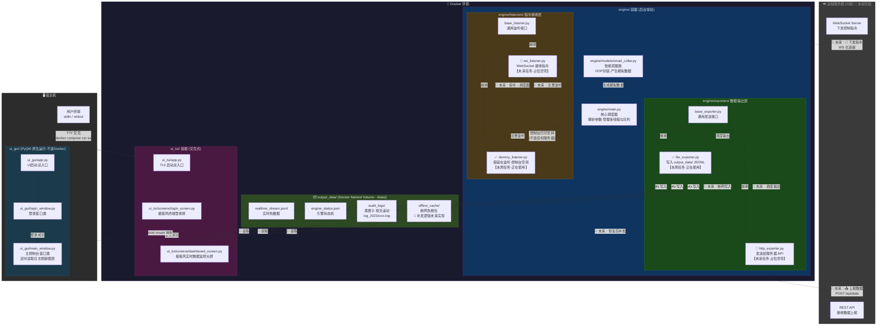

# C端狗项圈数据生成器

---

这是我们小组的狗项圈数据生成器，主要会生成一些数据，来模拟狗项圈检测到的

我们考虑的**架构** 是:
```
C_end_Simulator/                 <-- 第一阶段大目录 (在总项目的 Git 管理下)
│
├── .gitignore                   <-- 忽略 venv、__pycache__、.idea 等
├── docker-compose.yml           <-- 新增：编排容器
│
├── output_data/
│   │
│   ├── realtime_stream.jsonl    <-- 【给 UI 看的】实时热数据（UI不断读取它来画折线图）
│   ├── engine_status.json       <-- 【状态机】记录 Docker 引擎的死活、当前网络状态
│   │
│   ├── offline_cache/           <-- 【断网急救包】积压的未发送数据
│   │   ├── .gitkeep
│   │   └── pending_1700001.json <-- 网络断开时，堆积在这里的数据块
│   │
│   └── audit_logs/              <-- 【黑匣子】历史对账审计日志
│       ├── .gitkeep
│       ├── log_20231024.log     <-- 按天滚动的历史文件
│       └── log_20231025.log
│
├── engine/                     <-- 【核心一：打工人 (放进 Docker)】
│   ├── Dockerfile              <-- 镜像打包说明书
│   ├── requirements.txt        <-- 依赖清单 (faker 等)
│   ├── main.py                 <-- 核心调度器 (解析参数、管理多线程与队列)
│   │
│   ├── models/                 <-- [业务模型层]
│   │   └── smart_collar.py     <-- 智能项圈类 (OOP 封装，产生模拟数据)
│   │
│   ├── exporters/              <-- [数据输出层：策略模式]
│   │   ├── base_exporter.py    <-- 定义通用发送接口
│   │   ├── file_exporter.py    <-- 本周任务：写入 output_data/ 的 JSONL 文件
│   │   └── http_exporter.py    <-- 未来任务：发送给服务器 API (占位)
│   │
│   └── listeners/              <-- [指令接收层：监听服务器]
│       ├── base_listener.py    <-- 定义通用监听接口
│       ├── dummy_listener.py   <-- 本周任务：假装在监听 (控制台打印空转)
│       └── ws_listener.py      <-- 未来任务：WebSocket 接收控制指令 (占位)
│
├── ui_gui/                     <-- 【核心二：桌面图形界面 (外部 PyQt 运行)】
│   ├── requirements.txt        <-- 依赖清单 (PyQt6)
│   ├── app.py                  <-- UI 启动总入口 (统筹登录窗和主界面的切换)
│   ├── login_window.py         <-- 登录窗口类 (处理账号密码，生成 user_id)
│   └── main_window.py          <-- 主控制台窗口类 (发号施令、定时读取日志刷新图表)
│
└── ui_tui/                     <-- 【核心三：终端字符界面 (外部 Textual 运行)】
    ├── Dockerfile              <-- 🆕 新增 TUI 专属 Dockerfile
    ├── requirements.txt        <-- 依赖清单 (textual)
    ├── app.py                  <-- TUI 启动总入口
    └── screens/                
        ├── login_screen.py     <-- 极客风终端登录屏
        └── dashboard_screen.py <-- 极客风实时数据监控大屏
    
```
数据流解析


