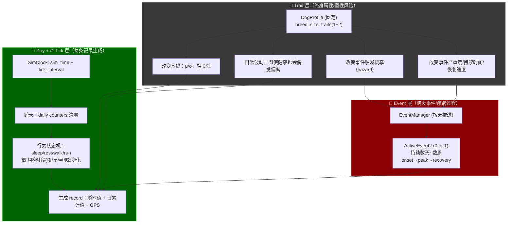
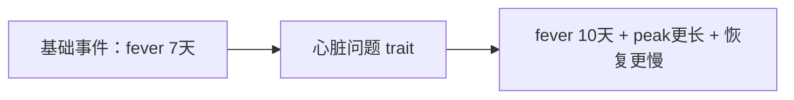
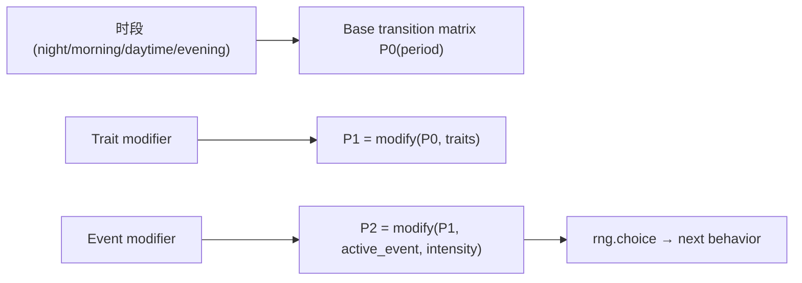
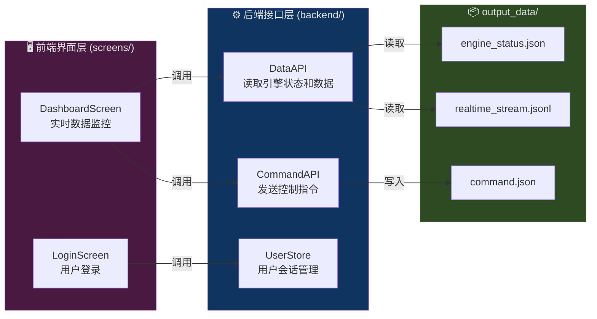

# C端狗项圈数据生成器

---

这是 PetNode 项目的 **C端（客户端）** 子系统——智能狗项圈数据模拟器。它负责模拟智能宠物项圈在真实场景中采集到的各类数据（心率、呼吸、体温、步数、GPS 等），并通过文件系统与 TUI/GUI 界面交互，实现数据展示和引擎控制。

## 架构设计

以下是完整的项目目录结构：
```
C_end_Simulator/                        <-- C端模拟器根目录（在总项目的 Git 管理下）
│
├── .gitignore                          <-- Git 忽略规则（venv、__pycache__、.idea、运行时数据文件等）
├── docker-compose.yml                  <-- Docker 编排配置（rabbitmq + mongodb + flask-server + mq-worker + engine + tui 六服务编排）
├── pytest.ini                          <-- pytest 测试框架配置（自定义 marker: docker）
├── README.md                           <-- 本文档
├── run_demo.sh                         <-- 一键演示脚本（快速启动整个系统）
│
├── scripts/
│   └── docker_build_test.sh            <-- Docker 构建与验证脚本（自动化测试镜像构建和容器运行）
│
├── output_data/                        <-- 【数据交换目录】Engine、TUI、GUI 通过此目录通信
│   ├── command.json                    <-- 【控制总线】TUI/GUI 往这里写指令 → Engine 轮询读取并执行
│   ├── realtime_stream.jsonl           <-- 【实时热数据】Engine 追加写入的 JSONL 格式数据流（给 UI 看的）
│   ├── engine_status.json              <-- 【引擎状态】记录引擎的运行/停止状态和进度信息
│   ├── engine_staus.json               <-- （历史遗留拼写错误文件，可忽略）
│   │
│   ├── offline_cache/                  <-- 【断网急救包】🔮 未来阶段：网络断开时积压的未发送数据
│   │
│   └── audit_logs/                     <-- 【黑匣子】🔮 未来阶段：按天滚动的历史审计日志
│
├── engine/                             <-- 【核心引擎：数据模拟 + 调度 (打包进 Docker)】
│   ├── Dockerfile                      <-- Engine 容器镜像构建说明
│   ├── requirements.txt                <-- Engine 依赖清单（numpy）
│   ├── main.py                         <-- ✅ 核心调度器（解析参数、管理多线程、轮询 command.json）
│   │
│   ├── models/                         <-- ✅ [业务模型层]
│   │   ├── __init__.py
│   │   ├── dog_profile.py              <-- ✅ 狗的长期属性（DogProfile：体型、年龄、traits、GPS 基准）
│   │   └── smart_collar.py             <-- ✅ 智能项圈类（OOP 封装，每 tick 产生一条模拟数据记录）
│   │
│   ├── traits/                         <-- ✅ [特质层：慢性病/体质修正]
│   │   ├── __init__.py
│   │   ├── base_trait.py               <-- ✅ 特质抽象基类（5 组修正参数 + drift 慢性波动机制）
│   │   ├── cardiac.py                  <-- ✅ CardiacRisk（心脏问题倾向：HR+10, 波动×1.2）
│   │   ├── respiratory.py              <-- ✅ RespiratoryRisk（呼吸道问题倾向：RR+4, 波动×1.2）
│   │   └── ortho.py                    <-- ✅ OrthoRisk（骨骼/关节问题倾向：步数×0.75, 受伤概率×2）
│   │
│   ├── events/                         <-- ✅ [事件层：疾病/受伤等长期事件]
│   │   ├── __init__.py
│   │   ├── base_event.py               <-- ✅ 事件抽象基类 + EventPhase（onset → peak → recovery）
│   │   ├── event_manager.py            <-- ✅ EventManager（按天推进事件、按概率触发新事件）
│   │   ├── fever.py                    <-- ✅ FeverEvent（发烧事件：体温+1.5°C、心率+15bpm）
│   │   └── injury.py                   <-- ✅ InjuryEvent（受伤事件：步数≈0、GPS≈不动）
│   │
│   ├── exporters/                      <-- ✅ [数据输出层：策略模式]
│   │   ├── __init__.py
│   │   ├── base_exporter.py            <-- ✅ 数据导出器抽象基类（BaseExporter ABC）
│   │   ├── file_exporter.py            <-- ✅ 文件导出器（JSONL 追加写入 output_data/）
│   │   ├── http_exporter.py            <-- ✅ HTTP 上报至 Flask 服务器（API Key 鉴权 + HMAC-SHA256 签名）
│   │   └── mq_exporter.py              <-- ✅ RabbitMQ 消息队列导出器（AMQP 发布 + 鉴权签名）
│   │
│   └── listeners/                      <-- [指令接收层：监听服务器下发指令]
│       ├── __init__.py
│       ├── base_listener.py            <-- ✅ 指令监听器抽象基类（BaseListener ABC）
│       ├── dummy_listener.py           <-- ✅ 占位监听器（每次 poll() 返回 None，不连接任何服务器）
│       └── ws_listener.py              <-- 🔮 WebSocket 指令监听器框架（暂未激活）
│
├── flask_server/                       <-- 【S端 Flask 数据服务器 (打包进 Docker)】
│   ├── Dockerfile                      <-- Flask 容器镜像构建说明
│   ├── app.py                          <-- ✅ Flask 主应用（API Key 鉴权 + HMAC-SHA256 验签 + MongoDB/FileStorage 双后端）
│   ├── requirements.txt                <-- Flask 依赖清单（flask + gunicorn + pymongo + pika）
│   ├── mq_worker.py                    <-- ✅ RabbitMQ 队列消费者（验签 + 入库 + ACK/NACK 重传机制）
│   │
│   ├── blueprints/                     <-- ✅ [vx API 路由层：微信登录 + 宠物遥测]
│   │   ├── wechat.py                   <-- ✅ 微信认证与绑定（/api/v1/wechat/*）
│   │   ├── users.py                    <-- ✅ 当前用户信息（/api/v1/me）
│   │   └── pets.py                     <-- ✅ 宠物遥测接口（/api/v1/pets/*）
│   │
│   ├── services/                       <-- ✅ [内部服务函数层：业务逻辑与数据库访问]
│   │   ├── identity.py                 <-- ✅ 用户身份哈希工具（normalize / build_user_hash / get_or_create）
│   │   ├── binding.py                  <-- ✅ 绑定/解绑服务（微信身份、设备关联、权限断言）
│   │   └── telemetry.py                <-- ✅ 遥测查询服务（呼吸/心率序列、事件列表）
│   │
│   └── storage/                        <-- ✅ [数据存储层：策略模式]
│       ├── __init__.py
│       ├── base_storage.py             <-- ✅ 存储抽象基类（BaseStorage ABC）
│       ├── file_storage.py             <-- ✅ 文件存储（JSONL 格式保存接收到的数据）
│       ├── mongo_storage.py            <-- ✅ MongoDB 存储实现（PyMongo + 自动索引）
│       └── mysql_storage.py            <-- ✅ MySQL 规范化存储（PyMySQL + 异常检测 + 档案查询）
│
├── tests/                              <-- ✅ [测试套件：按开发步骤分层组织]
│   ├── __init__.py
│   ├── requirements.txt                <-- 测试依赖清单（pytest + numpy）
│   ├── test_step1_data_generation.py   <-- ✅ Step 1：数据生成测试（Profile/Traits/Events/SmartCollar）
│   ├── test_step2_file_exporter.py     <-- ✅ Step 2：文件导出测试（JSONL 写入与读取验证）
│   ├── test_step3_scheduler.py         <-- ✅ Step 3：调度器集成测试（main.run() 端到端）
│   ├── test_step4_docker_build.py      <-- ✅ Step 4：Docker 镜像构建测试（需 Docker 环境）
│   ├── test_step4_module_health.py     <-- ✅ Step 4：模块健康检查（所有模块导入验证）
│   ├── test_step4_multithreading.py    <-- ✅ Step 4：多线程安全测试（并发读写验证）
│   ├── test_step5_tui_backend.py       <-- ✅ Step 5：TUI 后端接口测试（DataAPI/CommandAPI/UserStore）
│   ├── test_vx_api.py                  <-- ✅ vx API 集成测试（微信登录/绑定/宠物遥测全流程）
│   └── test_internal_services.py       <-- ✅ 内部服务函数单元测试（identity/binding/telemetry）
│
├── ui_gui/                             <-- 【桌面图形界面 (PyQt6，宿主机运行，不打包进 Docker)】
│   ├── __init__.py
│   ├── PyQt6_test.py                   <-- 简单 PyQt6 测试脚本
│   ├── requirements.txt                <-- GUI 依赖清单（PyQt6）
│   ├── app.py                          <-- GUI 启动总入口（占位，待实现）
│   ├── login_window.py                 <-- 登录窗口类（占位，待实现）
│   └── main_window.py                  <-- 主控制台窗口类（占位，待实现）
│
└── ui_tui/                             <-- 【终端交互界面 PetNodeOS (Textual，打包进 Docker)】
    ├── Dockerfile                      <-- TUI 容器镜像构建说明
    ├── requirements.txt                <-- TUI 依赖清单（textual）
    ├── app.py                          <-- TUI 启动入口（注入后端 API，管理屏幕切换）
    │
    ├── backend/                        <-- 【TUI 后端接口层：前后端分离】
    │   ├── __init__.py
    │   ├── data_api.py                 <-- ✅ 数据读取接口（读 engine_status.json + realtime_stream.jsonl）
    │   ├── command_api.py              <-- ✅ 指令发送接口（写 command.json 控制引擎）
    │   └── user_store.py               <-- ✅ 用户登录与会话管理（user_id 生成 + 狗数量记录）
    │
    └── screens/                        <-- 【TUI 前端界面层】
        ├── __init__.py
        ├── login_screen.py             <-- ✅ PetNodeOS 品牌登录屏（ASCII Art + 用户名/狗数量输入）
        └── dashboard_screen.py         <-- ✅ 实时数据监控大屏（数据表 + 控制面板 + 操作日志）

```
## 数据流解析

下图展示了系统各组件之间的数据流向——Engine 如何生成数据、数据如何通过共享文件传递到 TUI/GUI、以及 TUI/GUI 如何通过指令文件控制 Engine：

```mermaid
flowchart TD
    subgraph FlaskServer["☁️ S端服务器 ✅ 已实现（第二阶段）"]

        subgraph FlaskApp["flask-server 容器"]
            api["POST /api/data<br/>✅ Bearer Token 鉴权<br/>✅ HMAC-SHA256 验签<br/>接收 Engine 上报数据"]
            health["GET /api/health<br/>✅ 健康检查接口"]
        end

        subgraph MqWorkerContainer["mq-worker 容器"]
            mq_worker_node["flask_server/mq_worker.py<br/>✅ RabbitMQ 消费者<br/>验签 + 入库<br/>ACK/NACK 重传机制"]
        end

        rabbitmq_node["🐇 RabbitMQ 容器<br/>队列 petnode.records<br/>AMQP 协议"]
        mongodb_node["🍃 MongoDB 容器<br/>petnode.received_records<br/>✅ PyMongo + 自动索引"]

        api -->|"✅ 写入"| mongodb_node
        mq_worker_node -->|"✅ 入库"| mongodb_node
        rabbitmq_node -->|"✅ 消费"| mq_worker_node
    end

    subgraph DockerEnv["🐳 Docker 环境 (打包给老师的部分)"]

        subgraph EngineContainer["engine/ 容器 (后台常驻)"]
            collar["engine/models/smart_collar.py<br/>智能项圈类<br/>OOP封装·产生模拟数据"]
            main["engine/main.py<br/>核心调度器<br/>解析参数·管理多线程与队列<br/>轮询读取 command.json"]

            subgraph Exporters["engine/exporters/ 数据输出层"]
                base_exp["base_exporter.py<br/>通用发送接口"]
                file_exp["✅ file_exporter.py<br/>写入 output_data/ JSONL<br/>【当前阶段·正在使用】"]
                http_exp["✅ http_exporter.py<br/>HTTP POST 上报<br/>API Key + HMAC 签名"]
                mq_exp["✅ mq_exporter.py<br/>RabbitMQ 发布<br/>AMQP + 鉴权签名"]
                base_exp -.->|"继承"| file_exp
                base_exp -.->|"继承"| http_exp
                base_exp -.->|"继承"| mq_exp
            end

            subgraph Listeners["engine/listeners/ 指令接收层"]
                base_lis["base_listener.py<br/>通用监听接口"]
                dummy_lis["✅ dummy_listener.py<br/>假装在监听·控制台空转<br/>【当前阶段·正在使用】"]
                ws_lis["🔮 ws_listener.py<br/>WebSocket 接收指令<br/>【未来阶段·占位空壳】"]
                base_lis -.->|"继承"| dummy_lis
                base_lis -.->|"继承"| ws_lis
            end

            collar -->|"生成模拟数据"| main
            main -->|"调度输出"| file_exp
            main -->|"✅ 调度上报"| http_exp
            main -->|"✅ 调度发布"| mq_exp
            main -->|"注册监听"| dummy_lis
            dummy_lis -->|"控制台打印空转<br/>(不连任何服务器)"| main
        end

        subgraph SharedVolume["📦 output_data/ (bind mount · /data/)"]
            cmd["command.json 🆕<br/>控制总线<br/>UI写指令 → Engine读指令"]
            stream["realtime_stream.jsonl<br/>实时热数据"]
            status["engine_status.json<br/>引擎状态机"]
            cache["offline_cache/<br/>断网急救包<br/>🔮 补发逻辑未来实现"]
            audit["audit_logs/<br/>黑匣子·按天滚动<br/>log_2023xxxx.log"]
        end

        subgraph TUIContainer["ui_tui/ 容器 (PetNodeOS 交互式终端·打包给老师)"]
            tui_app["ui_tui/app.py<br/>TUI 启动总入口<br/>注入后端API·管理屏幕切换"]
            tui_backend["ui_tui/backend/<br/>后端接口层<br/>DataAPI·CommandAPI·UserStore"]
            login_scr["ui_tui/screens/login_screen.py<br/>PetNodeOS品牌登录屏<br/>用户名+狗数量输入"]
            dash_scr["ui_tui/screens/dashboard_screen.py<br/>实时数据监控大屏<br/>数据表+控制面板+操作日志"]
            tui_app --> tui_backend
            tui_app --> login_scr
            login_scr -->|"登录成功"| dash_scr
            dash_scr -->|"调用后端API"| tui_backend
        end

        %% ✅ 当前阶段：Engine 写数据
        file_exp -->|"✍️ 写入"| stream
        file_exp -->|"✍️ 写入"| status
        file_exp -->|"✍️ 写入"| audit

        %% ✅ 当前阶段：Engine 读指令
        cmd -->|"👀 轮询读取指令"| main

        %% ✅ 当前阶段：TUI 读数据
        stream -->|"👀 读取"| dash_scr
        status -->|"👀 读取"| dash_scr
        audit -->|"👀 读取"| dash_scr

        %% ✅ 当前阶段：TUI 写指令
        dash_scr -->|"✍️ 写指令<br/>(开始/停止/调频率)"| cmd
    end

    subgraph Host["🖥️ 宿主机 (不打包进 Docker)"]
        terminal["用户终端<br/>stdin / stdout"]

        subgraph GUIApp["ui_gui/ (PyQt6 原生运行·无法打包进Docker)"]
            gui_app["ui_gui/app.py<br/>UI启动总入口"]
            gui_login["ui_gui/login_window.py<br/>登录窗口类"]
            gui_main["ui_gui/main_window.py<br/>主控制台窗口类<br/>定时读取日志刷新图表"]
            gui_app --> gui_login
            gui_login -->|"登录成功"| gui_main
        end
    end

    %% ✅ 当前阶段：终端 TTY 交互
    terminal <-->|"TTY 交互<br/>docker compose run tui"| tui_app

    %% ✅ 当前阶段：GUI 读数据 + 写指令（宿主机直接访问 output_data/）
    stream -.->|"👀 读取"| gui_main
    status -.->|"👀 读取"| gui_main
    gui_main -.->|"✍️ 写指令"| cmd

    %% ✅ 第二阶段：HTTP 上报通道（已实现）
    http_exp -->|"✅ POST /api/data<br/>Bearer Token + X-Signature"| api

    %% ✅ 第二阶段：MQ 上报通道（已实现）
    mq_exp -->|"✅ AMQP 发布<br/>petnode.records 队列"| rabbitmq_node

    %% 🔮 未来阶段（虚线）
    file_exp -.->|"🔮 未来：断网写入"| cache
    cache -.->|"🔮 未来：恢复后补发"| http_exp
    main -.->|"🔮 未来：注册监听"| ws_lis
    ws_lis -.->|"🔮 未来：指令→调度器"| main

    style FlaskServer fill:#1a3a1a,stroke:#2d9a2d,color:#e0e0e0
    style FlaskApp fill:#0f3010,stroke:#2d7a2d,color:#e0e0e0
    style MqWorkerContainer fill:#0f3010,stroke:#2d7a2d,color:#e0e0e0
    style DockerEnv fill:#1a1a2e,stroke:#16213e,color:#e0e0e0
    style EngineContainer fill:#0f3460,stroke:#533483,color:#e0e0e0
    style Exporters fill:#1a4a1a,stroke:#2d7a2d,color:#e0e0e0
    style Listeners fill:#4a3a1a,stroke:#7a6a2d,color:#e0e0e0
    style SharedVolume fill:#2d4a22,stroke:#3a5a2c,color:#e0e0e0
    style TUIContainer fill:#4a1942,stroke:#6a2c70,color:#e0e0e0
    style Host fill:#2c2c2c,stroke:#555,color:#e0e0e0
    style GUIApp fill:#1b3a4b,stroke:#2d6187,color:#e0e0e0
```


## 开发流程

项目采用分步迭代的方式开发，每一步建立在上一步的基础上。以下流程图展示了从"数据生成"到"打包交付"的完整开发路径：

```mermaid
flowchart TD
    subgraph Step1["✅ 第一步：让数据能生出来"]
        s1["smart_collar.py + dog_profile.py<br/>+ traits/ + events/<br/>OOP 封装·每 Tick(15min) 生成一条模拟数据"]
    end

    subgraph Step2["✅ 第二步：让数据能写到文件"]
        s2["base_exporter.py (ABC) → file_exporter.py<br/>把 record 以 JSONL 追加写入 output_data/"]
    end

    subgraph Step3["✅ 第三步：让调度器串起来"]
        s3["main.py<br/>每隔几秒调用项圈生成数据<br/>再调用 exporter 写出去"]
    end

    subgraph Step4["✅ 第四步：能跑进 Docker"]
        s4["Dockerfile + docker-compose.yml<br/>engine 容器能启动并持续生成数据"]
    end

    subgraph Step5["✅ 第五步：TUI 能看到数据"]
        s5["ui_tui/ 全部代码<br/>backend/ 后端接口层 + screens/ 前端界面层<br/>前后端分离·读 JSONL 画到终端屏幕上"]
    end

    subgraph Step6["✅ 第六步：TUI 能控制 Engine"]
        s6["command.json 读写<br/>TUI 通过 CommandAPI 发指令·Engine 响应"]
    end

    subgraph Step7["✅ 第七步：收尾打包"]
        s7["dummy_listener + 占位文件<br/>补全骨架·测试完整流程·交付老师"]
    end

    subgraph Step8["✅ 第八步：Flask RESTful API + 文件存储"]
        s8["flask_server/app.py<br/>POST /api/data 接收数据上报<br/>GET /api/health 健康检查<br/>FileStorage 本地文件存储"]
    end

    subgraph Step9["✅ 第九步：API Key 鉴权 + HMAC 签名验证"]
        s9["Bearer Token 鉴权（Authorization 头）<br/>X-Signature 防篡改（HMAC-SHA256）<br/>Engine 签名 → 服务端验签"]
    end

    subgraph Step10["✅ 第十步：MongoDB 存储后端"]
        s10["MongoStorage（PyMongo + 自动索引）<br/>替代 FileStorage 作为默认存储<br/>STORAGE_BACKEND 环境变量切换"]
    end

    subgraph Step11["✅ 第十一步：RabbitMQ 消息队列"]
        s11["MqExporter（Engine 端 producer）<br/>mq_worker.py（消费者·验签+入库）<br/>petnode.records 队列 + ACK/NACK 重传"]
    end

    subgraph Step12["✅ 第十二步：Docker Compose 完整编排"]
        s12["rabbitmq + mongodb + flask-server<br/>+ mq-worker + engine (+ tui)<br/>healthcheck + depends_on 依赖链"]
    end

    Step1 -->|"能生"| Step2
    Step2 -->|"能写"| Step3
    Step3 -->|"能跑"| Step4
    Step4 -->|"能看"| Step5
    Step5 -->|"能控"| Step6
    Step6 -->|"能交"| Step7
    Step7 -->|"上报"| Step8
    Step8 -->|"鉴权"| Step9
    Step9 -->|"持久化"| Step10
    Step10 -->|"解耦"| Step11
    Step11 -->|"编排"| Step12

    style Step1 fill:#006400,stroke:#00FF00,color:#e0e0e0
    style Step2 fill:#006400,stroke:#00FF00,color:#e0e0e0
    style Step3 fill:#006400,stroke:#00FF00,color:#e0e0e0
    style Step4 fill:#006400,stroke:#00FF00,color:#e0e0e0
    style Step5 fill:#006400,stroke:#00FF00,color:#e0e0e0
    style Step6 fill:#006400,stroke:#00FF00,color:#e0e0e0
    style Step7 fill:#006400,stroke:#00FF00,color:#e0e0e0
    style Step8 fill:#006400,stroke:#00FF00,color:#e0e0e0
    style Step9 fill:#006400,stroke:#00FF00,color:#e0e0e0
    style Step10 fill:#006400,stroke:#00FF00,color:#e0e0e0
    style Step11 fill:#006400,stroke:#00FF00,color:#e0e0e0
    style Step12 fill:#006400,stroke:#00FF00,color:#e0e0e0

```



## 代码核心逻辑——狗项圈模拟器

本节详细说明了模拟引擎的核心算法逻辑，包括数据模型设计、三层系统架构、行为状态机、事件触发机制等。

### 0. 目标和约束

以下是模拟系统的核心设计约束，所有数据生成逻辑都遵循这些规则：

- Traits：固定不变；可叠加；每只狗最多 1~2 个
- 长期事件（疾病/受伤等）：按“天”触发/推进；可持续数天到数周
- 慢性病（Trait）需要有“日常波动”（即使没有事件也会出现偏离）
- Day 概念：日累计指标（如步数）在一天内只增不减，午夜清零
- GPS：连续值；变化速度取决于当前行为状态（sleeping 最慢，running 最快）
- 电量不考虑
- Tick：每一轮生成一条记录；默认 1 tick = 15 min（可通过 tick_interval 参数调整）

### 1. 核心对象——DogProfile（狗的长期属性）

`DogProfile` 是每只狗的"身份证"，在创建时确定，整个模拟过程中不变。它包含以下属性：

DogProfile
- dog_id: str
- breed_size: small/medium/large
- age_stage: puppy/adult/senior   (可选)
- traits: set[Trait]
    - CardiacRisk (心脏问题倾向)
    - RespiratoryRisk (呼吸道问题倾向)
    - OrthoRisk (骨骼/关节问题倾向)
- baseline_modifiers:
    - heart_rate_mean_offset: +x
    - resp_rate_mean_offset: +y
    - temperature_mean_offset: +z
    - hr_variability_multiplier: *k
    - rr_variability_multiplier: *k
- event_hazard_multipliers:
    - fever: *1.2
    - cold: *1.5
    - heatstroke: *1.1
    - injury: *2.0 (骨骼问题更容易拉伤/跛行)
- event_severity_multipliers:
    - fever: severity *1.3, duration +2 days
    - injury: duration *2.0, steps_multiplier lower

### 2. 三层系统架构——谁负责什么

模拟引擎的数据生成逻辑分为三个层次，每层各司其职：



### 数据分类

模拟引擎生成的数据按生命周期和更新频率分为四类：

A) 瞬时值（per-tick instant）
- heart_rate（心率）
- resp_rate（呼吸频率）
- resting_heart_rate（静息心率：可作为派生指标/或在 resting/sleeping 时输出）
- sleep_state（睡眠状态：sleeping/resting/...）
- anomaly_flags（异常行为检测结果：由阈值/规则产生）

B) 日累计值（per-day cumulative; within-day monotonic）
- today_steps（今日累计步数）：一天内只增不减；跨天清零
  生成逻辑是 Δsteps（本 tick 新增步数）→ today_steps += Δsteps

C) 连续状态值（continuous; depends on previous tick）
- gps_lat/gps_lng：由上一个位置 + 偏移得到；偏移尺度由行为状态决定

D) 长期状态（跨天/跨周）
- traits（固定，不可改变）
- active_event（可能为 None 或某个事件）
- event_day_index / phase / intensity（事件过程）

### 事件触发概率

事件的触发采用概率模型，综合考虑基础概率、Trait 修正和环境因素：

P(event | dog, day, context)
= base_rate(event, season, day_type)
  × trait_multiplier(dog.traits, event)
  × context_multiplier(behavior, weather, activity_load)

举例：

有 心脏问题倾向：

“静息心率异常/心律不齐事件”概率更高
高强度运动时触发概率更高（context 叠加）
有 呼吸道问题倾向：

“呼吸频率异常/喘息/夜间咳嗽事件”概率更高
睡眠时也可能出现异常呼吸（改变夜间分布）
有 骨骼问题倾向：

“受伤/跛行”更容易发生
行为层会表现为：跑步概率更低、GPS移动更少、Δsteps更小

心脏风险：μ_offset +10 bpm，σ_mult 1.2（波动更大）
呼吸道风险：resp μ_offset +4，sleeping 时也不至于太低
骨骼问题：不一定改心率，但会改 Δsteps 的均值（走得少）和 running 概率（更少跑）
（相关随机数必须符合Numpy随机数

trait会影响到，狗的康复时间



engine/models/
- dog_profile.py      # 生成每只狗的长期属性（traits）
- smart_collar.py     # 行为层 + 日累计 + GPS + 事件层（使用 profile）

engine/events/
- base_event.py       # 事件抽象（持续天数、强度曲线）
- fever.py, injury.py # 具体事件
- event_manager.py    # 每天触发/推进事件（受 traits 影响）

engine/traits/
- base_trait.py
- cardiac.py
- respiratory.py
- ortho.py

### 时间体系

模拟引擎使用虚拟时钟推进模拟时间：

- sim_time: datetime（模拟时间）
- tick_interval: timedelta（每 tick 推进多少模拟时间）
- 每次 generate_one_record()：sim_time += tick_interval

当 sim_time.date != current_day:
- current_day = sim_time.date
- today_steps = 0
- 触发“每天一次”的逻辑（EventManager.advance_day）

### 行为状态机

狗的行为状态通过马尔可夫链转移，当前状态和时间段共同决定下一个状态的概率：



### 一天内的时间段分类

系统将 24 小时划分为四个时段，不同时段的行为转移概率不同：

- night:    22:00-06:00
- morning:  06:00-09:00
- daytime:  09:00-18:00
- evening:  18:00-22:00

不同时间段会改变状态机各个状态之间转移的概率，比如evening的时候，睡觉的概率会更高

### Trait 如何修正行为概率

Trait（慢性体质特质）通过加法修正影响行为转移概率：

- RespiratoryRisk / CardiacRisk：提高 sleeping/resting 概率，降低 running 概率（幅度小）
- OrthoRisk：显著降低 running 概率，略降低 walking 概率
- ActiveEvent 在 peak 时：强力提高 sleeping/resting，running 几乎为 0
- 修正后要重新归一化（概率和=1）

### GPS 生成逻辑

GPS 坐标基于上一次位置进行随机偏移，偏移量取决于当前行为状态：

每 tick 更新：
new_lat = lat + Δlat
new_lng = lng + Δlng

其中 Δlat/Δlng 的标准差 σ 取决于 behavior：

sleeping: σ = 0
resting:  σ = tiny（几乎不动，只有抖动）
walking:  σ = small
running:  σ = large

### Trait 对 GPS 的修正

- OrthoRisk：walking/running 的 σ 下调（更少移动）
- Injury event peak：walking/running 的 σ ≈ 0（基本不动）

### 步数模型

每个 tick 的步数增量通过行为驱动的正态分布生成：

Δsteps = f(behavior) + noise
today_steps += max(0, int(Δsteps))

noise是一个小幅度的高斯噪声，为了模拟随机性，可以对一些指标加上高斯噪音

### Trait/事件对步数的影响

Trait 和活跃事件都会修正步数倍率：

- OrthoRisk：Δsteps 的均值下降（走得少）
- ActiveEvent（发烧/感冒）：
  - onset：Δsteps × 0.8
  - peak： Δsteps × 0.3
  - recovery：Δsteps × 0.6 → 1.0
- Injury peak：Δsteps × 0.0~0.1

### 慢性病日常波动（Trait Drift 机制）

Trait（慢性体质特质）通过两种机制体现"日常波动"——即使没有 active_event，也会偶尔出现生理指标的"偏离"。这种偏离是低幅度、可持续一段时间（小时级/天级）的缓慢变化，而非突发性异常。系统通过两种机制同时作用：

**基线偏移（永久）**：例如 CardiacRisk 使静息 HR 均值 +10，波动更大（σ×1.2）。

**慢性波动（短周期的 Drift 漂移）**：引入 TraitDrift（漂移项），每隔 N ticks 缓慢更新：

TraitDrift 规范：
- 每个 trait 都可以贡献一个 drift 值：drift_hr(t), drift_rr(t)
- drift 不是每 tick 重新采样，而是"每 N ticks 更新一次"（默认 60 ticks ≈ 1 小时）
- 最终瞬时值 = 行为基准 + trait 基线偏移 + drift + event 叠加 + 随机噪声

实际效果：

- 呼吸道问题：夜间 RR 偶尔偏高，持续几十分钟到几小时
- 心脏问题：静息 HR 偶尔持续偏快一段时间
- 骨骼问题：活动量长期偏低，不一定要"事件"才能看出来

### EventManager——按天推进事件

EventManager 是事件系统的核心管理器，负责事件的触发和生命周期推进。

#### 事件触发（每天一次）

每天午夜（模拟时间跨天时）自动执行以下逻辑：
- 调用 `EventManager.advance_day()`
- 若当前没有 active_event：
  - 计算每类事件的触发概率 hazard = base_hazard × trait_multiplier
  - 按独立 Bernoulli 分布抽样，最多触发 1 个事件（避免多事件叠加太复杂）

#### 事件推进（每天一次）

已有事件的推进逻辑：
- active_event.day_index += 1（推进一天）
- 根据 day_index / duration_days 计算当前阶段 phase（onset → peak → recovery）
- intensity = intensity_curve(phase, within_phase_progress)（计算当前强度）
- 若 day_index >= duration_days：active_event = None（事件结束，狗痊愈）

#### Trait 对事件的三种影响

Trait 通过以下三种方式让事件"更容易发生、更难好"：
1. **hazard_multiplier**：提高事件触发概率（如 OrthoRisk 使受伤概率 ×2.0）
2. **duration_multiplier**：延长事件持续时间（如 CardiacRisk 使发烧持续 ×1.3）
3. **severity_multiplier**：加重事件严重度（如 CardiacRisk 使发烧严重度 ×1.3）

### 每 Tick 生成 record 的完整流水线

以下是 `generate_one_record()` 方法每次调用时的执行顺序（**顺序很重要，避免 Bug**）：

```Mermaid
flowchart TD
    A["Tick开始: generate_one_record()"] --> B["1) sim_time += tick_interval"]
    B --> C{"2) 跨天了吗？"}
    C -->|是| D["2.1) today_steps=0<br/>EventManager.advance_day()"]
    C -->|否| E["3) 计算 time_period(夜/早/昼/晚)"]
    D --> E
    E --> F["4) 行为状态转移：<br/>P0(period)→Trait修正→Event修正→choice()"]
    F --> G["5) 生成瞬时值基准(正态)：<br/>vital_base = N(μ_behavior, σ_behavior)"]
    G --> H["6) 加 Trait 基线偏移 + Trait drift（慢性波动）"]
    H --> I["7) 生成 Δsteps（由 behavior 决定）并做 Trait/Event 修正"]
    I --> J["8) today_steps += max(0, int(Δsteps))"]
    J --> K["9) 更新 GPS：上一位置 + Δpos(behavior) 再做 Trait/Event 修正"]
    K --> L["10) 加 Event 叠加效果（按天 intensity）到瞬时值上"]
    L --> M["11) clamp/修正边界；组装 record 输出"]
```

### 输出 record 的字段说明

每条模拟数据记录包含以下 12 个字段（**不包含 `user_id`，Engine 只上报 `device_id`**）：

| 字段 | 类型 | 说明 |
|------|------|------|
| `device_id` | `str` | 设备（狗）唯一标识 |
| `timestamp` | `str` | 模拟时间戳（ISO 8601 格式） |
| `behavior` | `str` | 当前行为状态（sleeping / resting / walking / running） |
| `heart_rate` | `float` | 心率（bpm，范围 30~250） |
| `resp_rate` | `float` | 呼吸频率（次/分钟，范围 8~80） |
| `temperature` | `float` | 体温（°C，范围 36.0~42.0） |
| `steps` | `int` | 今日累计步数（跨天清零） |
| `battery` | `int` | 电量百分比（当前固定 100，不模拟电量消耗） |
| `gps_lat` | `float` | GPS 纬度 |
| `gps_lng` | `float` | GPS 经度 |
| `event` | `str\|None` | 当前活跃事件名称（无事件时为 None） |
| `event_phase` | `str\|None` | 事件阶段（onset / peak / recovery，无事件时为 None） |

## TUI 界面系统（PetNodeOS 终端交互界面）

### 架构概述：前后端分离

TUI 严格遵循**前后端分离**原则：界面渲染层（`screens/`）不直接操作文件系统，所有数据读写都通过后端接口层（`backend/`）完成。这种设计使得界面代码和数据逻辑互不耦合，便于测试和维护。

```
ui_tui/
├── app.py              <-- 应用入口：注入后端 API + 管理屏幕切换
├── backend/            <-- 【后端接口层】所有 I/O 和数据逻辑
│   ├── data_api.py     <-- 读引擎状态 + 实时数据流
│   ├── command_api.py  <-- 写控制指令
│   └── user_store.py   <-- 用户登录/会话管理
└── screens/            <-- 【前端界面层】纯 UI 渲染和交互
    ├── login_screen.py     <-- 登录屏
    └── dashboard_screen.py <-- 监控大屏
```



### 后端接口详解

#### 1. DataAPI（数据读取接口）

**位置**：`ui_tui/backend/data_api.py`

负责从 `output_data/` 目录读取引擎生成的数据，为 TUI 前端提供统一的数据访问方法。

| 方法 | 参数 | 返回值 | 说明 |
|------|------|--------|------|
| `get_engine_status()` | — | `dict \| None` | 读取 `engine_status.json`，返回引擎运行状态 |
| `get_latest_records(n)` | `n: int = 20` | `list[dict]` | 读取最新 n 条数据记录（时间倒序） |
| `get_records_by_device(device_id, n)` | `device_id: str, n: int = 20` | `list[dict]` | 按设备 ID 筛选记录 |
| `get_total_record_count()` | — | `int` | 获取记录总数 |
| `get_unique_devices()` | — | `list[str]` | 获取所有唯一设备 ID |

> 说明：由于 Engine record 不含 `user_id`，设备级查询是当前唯一稳定的数据筛选方式。

**使用示例**：

```python
from ui_tui.backend import DataAPI

api = DataAPI(output_dir="/app/output_data")

# 获取引擎状态
status = api.get_engine_status()
# → {"running": True, "num_dogs": 2, "current_tick": 50, ...}

# 获取最新 10 条记录
records = api.get_latest_records(10)
# → [{"device_id": "dog_xxx", "heart_rate": 80, ...}, ...]
```

#### 2. CommandAPI（指令发送接口）

**位置**：`ui_tui/backend/command_api.py`

负责向 `command.json` 写入控制指令，引擎通过轮询此文件来读取并执行指令。

| 方法 | 参数 | 说明 |
|------|------|------|
| `send_stop()` | — | 发送停止指令 |
| `send_pause()` | — | 发送暂停指令 |
| `send_resume()` | — | 发送恢复指令 |
| `send_set_interval(interval)` | `interval: float` | 设置 tick 间隔（秒） |
| `clear_command()` | — | 清空指令文件 |
| `get_current_command()` | — | 读取当前指令 |

**使用示例**：

```python
from ui_tui.backend import CommandAPI

cmd = CommandAPI(output_dir="/app/output_data")

cmd.send_pause()              # 暂停引擎
cmd.send_resume()             # 恢复引擎
cmd.send_set_interval(2.0)    # 设置间隔为 2 秒
cmd.send_stop()               # 停止引擎
```

**指令格式**（写入 `command.json`）：

```json
{"action": "stop"}
{"action": "pause"}
{"action": "resume"}
{"action": "set_interval", "value": 2.0}
```

#### 3. UserStore（用户管理接口）

**位置**：`ui_tui/backend/user_store.py`

负责用户登录和会话管理。用户登录时需提供用户名和狗数量，系统生成确定性的 `user_id`。**该 `user_id` 属于本地会话语义，不会写入 Engine 上报 record。**

| 方法/属性 | 参数 | 返回值 | 说明 |
|-----------|------|--------|------|
| `login(username, num_dogs)` | `username: str, num_dogs: int` | `str` | 登录并返回 user_id |
| `logout()` | — | — | 登出，清除会话 |
| `is_logged_in` | — | `bool` | 是否已登录 |
| `user_id` | — | `str` | 当前用户 ID |
| `username` | — | `str` | 当前用户名 |
| `num_dogs` | — | `int` | 当前用户的狗数量 |
| `get_user_info()` | — | `dict \| None` | 获取完整用户信息 |

**使用示例**：

```python
from ui_tui.backend import UserStore

store = UserStore()

# 登录（3 只狗 → 引擎将开 3 个线程）
user_id = store.login("alice", 3)
# → "user_2bd806c9"（确定性哈希）

print(store.num_dogs)   # → 3
print(store.is_logged_in)  # → True

# 登出
store.logout()
```

**user_id 生成规则**：

- 基于用户名的 SHA-256 哈希前 8 位十六进制字符
- 格式：`user_<8 hex chars>`
- 相同用户名始终产生相同的 user_id（确定性）

### TUI 界面说明

#### 登录屏（LoginScreen）

- PetNodeOS 品牌 ASCII Art 标题
- 用户名输入框
- 狗数量输入框（1-10，决定引擎线程数）
- 登录按钮
- 快捷键：`Escape` 退出

#### 监控大屏（DashboardScreen）

- **状态栏**：显示用户信息、引擎运行状态、记录统计
- **数据表**：实时展示每只狗的最新数据（心率、呼吸、体温、步数、行为、GPS、事件）
- **控制面板**：暂停/恢复/停止/刷新/调整 tick 间隔
- **操作日志**：记录所有用户操作和系统事件
- **快捷键**：`P` 暂停/恢复、`S` 停止、`R` 刷新、`L` 登出、`Escape` 退出
- **自动刷新**：每 2 秒自动从后端拉取最新数据

### TUI 运行方式

```bash
# 本地直接运行（需先安装 textual）
pip install textual>=0.40
cd C_end_Simulator
python -m ui_tui.app

# 指定数据目录
python -m ui_tui.app --output-dir ./output_data

# Docker 运行（先启动引擎，再启动 TUI）
docker compose up -d engine
docker compose --profile tui run --rm tui
```


---

## 📖 使用说明书

本说明书面向开发者和使用者，详细介绍 PetNode C端模拟器的整体代码结构、各模块功能、测试脚本使用方法、Docker 部署方式以及完整的 API 接口参考。

---

### 一、整体代码架构总览

PetNode C端模拟器是一个**智能宠物项圈数据模拟系统**，模拟真实场景中狗项圈采集的各类生理和行为数据。整个系统由三大部分组成：

| 组件 | 目录 | 运行方式 | 职责 |
|------|------|----------|------|
| **模拟引擎** | `engine/` | Docker 容器 | 生成模拟数据（心率、呼吸、体温、步数、GPS 等） |
| **TUI 终端界面** | `ui_tui/` | Docker 容器 | 在终端中展示实时数据并控制引擎 |
| **GUI 桌面界面** | `ui_gui/` | 宿主机直接运行 | PyQt6 桌面图形界面（当前为占位结构） |

**三者之间的通信方式**：通过 `output_data/` 共享目录进行文件级通信，不依赖网络：

```
Engine ──写入──→ realtime_stream.jsonl ──读取──→ TUI/GUI（展示数据）
Engine ──写入──→ engine_status.json    ──读取──→ TUI/GUI（显示状态）
TUI/GUI ─写入──→ command.json          ──轮询──→ Engine（执行指令）
```

**核心设计原则**：
- **策略模式**：Exporter（数据输出）和 Listener（指令接收）均通过抽象基类定义接口，运行时注入具体实现
- **前后端分离**：TUI 界面层与数据逻辑层严格分离，通过 backend API 交互
- **可复现性**：通过随机种子 (seed) 参数控制所有随机行为，相同种子产生相同数据
- **多线程并行**：每个 tick 内，各只狗的数据在独立线程中并行生成

---

### 二、各模块详细说明

#### 2.1 engine/main.py —— 核心调度器

这是引擎的"大脑"，负责串联所有组件并驱动主循环。

**功能**：
- 解析命令行参数（设备分组数、狗数、tick 数、间隔、种子等）
- 创建 SmartCollar（项圈）实例，每只狗对应一个
- 创建 FileExporter（数据导出器）和 DummyListener（指令监听器）
- 运行主循环：每轮 tick → 轮询指令 → 多线程生成数据 → 导出到文件
- 支持优雅退出（Ctrl-C / SIGTERM）

**命令行参数**：

| 参数 | 默认值 | 说明 |
|------|--------|------|
| `--groups` | 1 | 设备分组数量（仅用于运行元数据；兼容旧参数 `--users`） |
| `--dogs` | 1 | 模拟的狗数量 |
| `--ticks` | 100 | 每只狗生成的 tick 总数 |
| `--tick-minutes` | 1 | 每个 tick 对应的模拟时间（分钟） |
| `--interval` | 0.0 | 每轮 tick 之间的真实等待秒数（0=尽快跑完） |
| `--seed` | None | 随机种子（用于可复现模拟） |
| `--output-dir` | output_data/ | 输出目录路径 |
| `--log-level` | INFO | 日志级别（DEBUG/INFO/WARNING/ERROR） |

**使用示例**：

```bash
# 默认运行（1 分组 1 只狗，100 ticks，尽快跑完）
python -m engine.main

# 2 分组 6 只狗，500 ticks，每 1 秒一轮，种子 42
python -m engine.main --groups 2 --dogs 6 --ticks 500 --interval 1 --seed 42

# 调试模式，详细日志
python -m engine.main --log-level DEBUG --dogs 2 --ticks 50
```

#### 2.2 engine/models/ —— 业务模型层

##### dog_profile.py —— 狗的长期属性

`DogProfile` 是每只狗的"身份证"数据类，包含：
- `dog_id`：唯一标识（12 位十六进制）
- `breed_size`：体型（small / medium / large）
- `age_stage`：年龄阶段（puppy / adult / senior）
- `traits`：慢性体质特质列表（0~2 个）
- `home_lat/lng`：GPS 基准位置（默认重庆大学坐标）

通过 `DogProfile.random_profile(rng)` 可随机生成一个完整的狗档案。

##### smart_collar.py —— 智能项圈模拟器

`SmartCollar` 是核心数据生成类，每次调用 `generate_one_record()` 产生一条完整的数据记录。

内部维护的状态包括：
- 模拟时钟（sim_time）
- 行为状态机（sleeping/resting/walking/running）
- 日累计步数（跨天清零）
- GPS 坐标（连续偏移）
- 事件管理器（EventManager）
- Trait 慢性波动（drift）

#### 2.3 engine/traits/ —— 特质层（慢性病/体质修正）

每个 Trait 代表一种终身属性，通过 5 组修正参数影响模拟的各个维度：

| Trait | 名称 | 核心效果 |
|-------|------|----------|
| `CardiacRisk` | 心脏问题倾向 | HR +10 bpm，波动 ×1.2，发烧概率 ×1.2，慢性 HR 漂移 |
| `RespiratoryRisk` | 呼吸道问题倾向 | RR +4 次/分，波动 ×1.2，感冒概率 ×1.5，慢性 RR 漂移 |
| `OrthoRisk` | 骨骼/关节问题倾向 | 步数 ×0.75，受伤概率 ×2.0，GPS 活动范围缩小 |

**关键文件**：
- `base_trait.py`：抽象基类，定义了 BaselineModifiers、EventHazardMultipliers、EventSeverityMultipliers、BehaviorModifiers、GpsSigmaMultipliers 五组修正参数，以及 drift 慢性波动机制
- `cardiac.py`、`respiratory.py`、`ortho.py`：三种具体 Trait 的实现，只需覆盖类属性即可

#### 2.4 engine/events/ —— 事件层（疾病/受伤）

事件系统模拟狗的疾病和受伤过程，每个事件有三个阶段：

```
onset（发病期）→ peak（高峰期）→ recovery（恢复期）
```

| 事件 | 基础持续天数 | 核心效果 |
|------|------------|----------|
| `FeverEvent` | 7 天 | 体温 +1.5°C，心率 +15 bpm，呼吸 +6 次/分 |
| `InjuryEvent` | 10 天 | 步数≈0（peak），GPS≈不动（peak），心率 +8 bpm |

**关键文件**：
- `base_event.py`：事件抽象基类，定义了 phase（阶段）、intensity（强度曲线）、vital_effect()、steps_multiplier_value() 等通用接口
- `event_manager.py`：事件管理器，按天推进事件生命周期，按概率触发新事件
- `fever.py`、`injury.py`：两种具体事件的实现

#### 2.5 engine/exporters/ —— 数据输出层

采用**策略模式**设计，调度器只依赖 `BaseExporter` 接口：

| 类 | 状态 | 说明 |
|----|------|------|
| `BaseExporter` | 抽象基类 | 定义 export() / flush() / close() 三个抽象方法 |
| `FileExporter` | ✅ 当前使用 | 将 record 以 JSONL 格式追加写入本地文件 |
| `HttpExporter` | ✅ 已实现 | 通过 HTTP POST 上报到 Flask 服务器（API Key + HMAC 签名） |
| `MqExporter` | ✅ 已实现 | 通过 RabbitMQ 消息队列发布数据（AMQP + 鉴权签名） |

#### 2.6 engine/listeners/ —— 指令接收层

同样采用**策略模式**，负责监听外部控制指令：

| 类 | 状态 | 说明 |
|----|------|------|
| `BaseListener` | 抽象基类 | 定义 poll() / close() 两个抽象方法 |
| `DummyListener` | ✅ 当前使用 | 每次 poll() 返回 None（不连接任何服务器，日志空转） |
| `WsListener` | 🔮 未来占位 | 通过 WebSocket 接收远程服务器指令（空壳） |

> **⚠️ 注意**：`dummy_listener.py` 是一个**有意设计的占位文件**，它的存在是为了在当前阶段（无远程服务器）让引擎的 Listener 接口有一个可运行的实现。当未来接入远程服务器时，只需替换为 `WsListener` 即可，无需修改调度器代码。**请勿删除此文件。**

#### 2.7 ui_tui/ —— TUI 终端交互界面

PetNodeOS 终端界面基于 [Textual](https://textual.textualize.io/) 框架构建，采用前后端分离架构。

**后端接口层（backend/）**：
- `data_api.py`：封装所有数据读取操作（读 JSONL 文件 + 引擎状态文件）
- `command_api.py`：封装所有指令发送操作（写 command.json）
- `user_store.py`：管理用户登录会话（生成 user_id、记录狗数量）

**前端界面层（screens/）**：
- `login_screen.py`：PetNodeOS 品牌登录屏，包含 ASCII Art Logo、用户名输入、狗数量输入
- `dashboard_screen.py`：实时数据监控大屏，包含状态栏、数据表、控制面板、操作日志

**入口文件（app.py）**：初始化 Textual App，注入后端 API 实例，管理屏幕切换。

#### 2.8 ui_gui/ —— GUI 桌面图形界面（占位）

基于 PyQt6 的桌面图形界面，当前为占位结构。由于 PyQt6 依赖宿主机的图形环境（X11/Wayland），**无法打包进 Docker 容器**，因此不参与 Docker 编排。

#### 2.9 flask_server/ —— S端数据服务器（✅ 第二阶段实现）

`flask_server/` 是 PetNode 的**服务端**，使用 Flask + Gunicorn 提供 HTTP RESTful API，并支持 RabbitMQ 消息队列通道。

当前数据库分工是：MongoDB 保存所有实时上报数据，MySQL 只保存固定档案信息（如用户/设备基础信息）和异常事件记录。

##### 2.9.1 RESTful API 接口

| 接口 | 方法 | 说明 |
|------|------|------|
| `/api/data` | POST | 接收 Engine 上报的项圈数据，鉴权+验签后持久化存储 |
| `/api/records` | GET | 统一查询接口，按用户、设备、时间范围查询 Mongo 或 MySQL |
| `/api/users/<user_key>/records` | GET | 按用户查询，支持 source= mongo/mysql |
| `/api/devices/<device_key>/records` | GET | 按设备查询，支持 source= mongo/mysql |
| `/api/profile` | GET | 查询 MySQL 固定档案信息（用户、设备、特质、事件字典） |
| `/api/health` | GET | 健康检查，返回服务状态和累计接收记录数 |

查询接口支持的常用参数：`source=mongo|mysql`、`kind=records|anomalies|profile`、`user_id`、`device_id`、`start_time`、`end_time`、`limit`、`offset`。Mongo 默认返回实时记录；MySQL 默认返回异常记录，`kind=profile` 时返回固定档案信息。

##### 2.9.2 鉴权机制（Bearer Token）

所有写入接口均要求在 `Authorization` 请求头中携带 API Key：

```
Authorization: Bearer <API_KEY>
```

未携带或 Key 不匹配时返回 **401 Unauthorized**。API Key 通过环境变量 `API_KEY` 配置。

##### 2.9.3 HMAC 签名验证（防篡改）

除 Bearer Token 外，Engine 还会在请求体签名后附加 `X-Signature` 头：

```
X-Signature: <HMAC-SHA256(请求体原始字节, HMAC_KEY)>
```

服务端接收到请求后使用 `hmac.compare_digest()` 恒时比较（防时序攻击），签名不匹配时返回 **403 Forbidden**。HMAC Key 通过环境变量 `HMAC_KEY` 配置。

##### 2.9.4 存储后端（策略模式）

存储层采用策略模式，通过环境变量 `STORAGE_BACKEND` 切换：

| 后端 | 环境变量值 | 说明 |
|------|-----------|------|
| `MongoStorage` | `mongo`（默认） | 写入 MongoDB，使用 PyMongo，自动建立复合索引 |
| `FileStorage` | `file` | 写入本地 JSONL 文件（降级备用，无需外部依赖） |
| `MySQLStorage` | `mysql` | MySQL 规范化存储（user/device/telemetry/anomaly 多表结构），支持异常自动检测 |

##### 2.9.5 消息队列架构（mq_worker.py）

`mq_worker.py` 是独立的 **RabbitMQ 消费者进程**（单独运行在 mq-worker 容器中）：

- 监听队列 `petnode.records`（由 Engine 的 `MqExporter` 发布）
- 接收到消息后：① 验证 HMAC 签名；② 写入存储后端（MongoStorage）；③ 发送 ACK
- 验签失败或存储异常时发送 NACK，消息重新入队（重传机制）

##### 2.9.6 vx 微信端 API（blueprints/）

`flask_server/blueprints/` 提供供微信小程序（vx）调用的 REST API：

| 路径 | 方法 | 说明 | 需要 Auth |
|------|------|------|-----------|
| `/api/v1/wechat/auth` | POST | code 换微信身份票据 | ❌ |
| `/api/v1/wechat/bind` | POST | 绑定微信身份与系统用户 | 可选 |
| `/api/v1/wechat/unbind` | POST | 解除微信绑定 | ✅ |
| `/api/v1/me` | GET | 获取当前用户信息与宠物列表 | ✅ |
| `/api/v1/pets/{pet_id}/summary` | GET | 宠物状态快照 | ✅ |
| `/api/v1/pets/{pet_id}/respiration/latest` | GET | 最新呼吸频率 | ✅ |
| `/api/v1/pets/{pet_id}/respiration/series` | GET | 呼吸频率时间序列 | ✅ |
| `/api/v1/pets/{pet_id}/heart-rate/latest` | GET | 最新心率 | ✅ |
| `/api/v1/pets/{pet_id}/heart-rate/series` | GET | 心率时间序列 | ✅ |
| `/api/v1/pets/{pet_id}/events` | GET | 事件列表（分页） | ✅ |

##### 2.9.7 内部服务函数层（services/）

`flask_server/services/` 是 vx API 的**内部业务逻辑层**，路由层调用这些函数而不直接操作数据库：

| 模块 | 函数分组 | 说明 |
|------|----------|------|
| `identity.py` | 身份哈希工具 | `normalize_identity()` / `build_user_hash()` / `get_or_create_user_hash()` |
| `binding.py` | 绑定/解绑服务 | 微信身份绑定、设备绑定、权限断言 |
| `telemetry.py` | 遥测数据查询 | 呼吸/心率最新值与时间序列、事件列表 |

> 详细函数签名、输入输出字段、异常说明请参见：[`docs/internal-functions.md`](docs/internal-functions.md)

---

### 三、测试脚本使用指南

#### 3.1 测试文件一览

| 测试文件 | 对应步骤 | 测试内容 | 是否需要 Docker |
|----------|----------|----------|:---------------:|
| `test_step1_data_generation.py` | Step 1 | DogProfile、Traits、Events、SmartCollar 数据生成 | 否 |
| `test_step2_file_exporter.py` | Step 2 | FileExporter JSONL 文件写入与读取 | 否 |
| `test_step3_scheduler.py` | Step 3 | main.py 的 run() 函数端到端测试 | 否 |
| `test_step4_docker_build.py` | Step 4 | Docker 镜像构建与容器运行验证 | **是** |
| `test_step4_module_health.py` | Step 4 | 所有模块的导入和基础功能验证 | 否 |
| `test_step4_multithreading.py` | Step 4 | 多线程并发数据生成和文件写入安全性 | 否 |
| `test_step5_tui_backend.py` | Step 5 | DataAPI、CommandAPI、UserStore 单元测试 | 否 |
| `test_vx_api.py` | vx API | 微信登录/绑定、宠物遥测全流程集成测试（mongomock） | 否 |
| `test_internal_services.py` | 服务层 | identity/binding/telemetry 内部函数单元测试（mongomock） | 否 |

#### 3.2 运行测试

```bash
# 进入项目目录
cd C_end_Simulator

# 安装测试依赖
pip install -r tests/requirements.txt

# 运行所有非 Docker 测试
pytest

# 运行所有测试（包括 Docker 测试，需要 Docker 环境）
pytest -m docker        # 仅 Docker 测试
pytest                  # 所有测试

# 运行单个测试文件
pytest tests/test_step1_data_generation.py

# 详细模式（显示每个测试用例名称和结果）
pytest -v

# 显示测试输出（不捕获 print）
pytest -s

# 运行特定测试类或方法
pytest tests/test_step1_data_generation.py::TestSmartCollar::test_record_fields
```

#### 3.3 各测试文件详解

**test_step1_data_generation.py**（数据生成测试）：
- 验证 DogProfile 的默认和随机创建
- 验证三种 Trait 的基线参数和 drift 更新
- 验证事件的阶段推进和强度曲线
- 验证 SmartCollar 的完整数据生成流水线（字段完整性、类型、范围）
- 验证步数的跨天清零和单日单调递增
- 验证行为分布的昼夜差异
- 验证随机种子的可复现性

**test_step2_file_exporter.py**（文件导出测试）：
- 验证 FileExporter 能正确创建 JSONL 文件
- 验证多条记录的追加写入和格式正确性
- 验证 flush() 和 close() 的行为

**test_step3_scheduler.py**（调度器集成测试）：
- 端到端测试 main.py 的 run() 函数
- 验证多用户多狗的数据生成和文件输出
- 验证引擎状态文件的写入

**test_step4_docker_build.py**（Docker 构建测试）：
- 验证 engine 镜像的构建
- 验证容器运行和数据输出
- 需要 Docker 环境，标记为 `@pytest.mark.docker`

**test_step4_module_health.py**（模块健康检查）：
- 验证所有模块能正常导入
- 验证基础对象能正常创建
- 用于快速检测代码结构是否完好

**test_step4_multithreading.py**（多线程安全测试）：
- 验证多线程并发调用 SmartCollar.generate_one_record() 的安全性
- 验证 FileExporter 在多线程写入下的数据完整性

**test_step5_tui_backend.py**（TUI 后端测试）：
- 验证 DataAPI 的数据读取功能
- 验证 CommandAPI 的指令发送功能
- 验证 UserStore 的登录/登出逻辑

---

### 四、Docker 部署与脚本使用

#### 4.1 Docker 架构总览

系统使用 Docker Compose 编排 **5 个核心服务**（+ 可选 TUI）：

```
┌──────────────────────────────────────────────────────────────────────┐
│                           宿主机 (Host)                               │
│                                                                      │
│  ┌─────────────┐   ┌─────────────┐   ┌────────────┐  ┌───────────┐  │
│  │  rabbitmq   │   │   mongodb   │   │flask-server│  │ mq-worker │  │
│  │  (AMQP)     │──▶│  (存储)     │◀──│  (HTTP API)│  │(队列消费者)│  │
│  │  :5672      │   │  :27017     │   │  :5000     │  │           │  │
│  └──────┬──────┘   └─────────────┘   └──────▲─────┘  └─────▲─────┘  │
│         │                                    │               │        │
│         └────────────────────────────────────┼───────────────┘        │
│                                              │                        │
│  ┌─────────────────────────────────────┐     │  output_data/          │
│  │  engine 容器（后台常驻）              │─────┘  ┌──────────────────┐  │
│  │  SmartCollar + HttpExporter         │        │  bind mount      │  │
│  │  SmartCollar + MqExporter           │◀──────▶│  realtime_stream │  │
│  └─────────────────────────────────────┘        │  command.json    │  │
│                                                 └──────────────────┘  │
│  ┌─────────────────┐                                    ▲             │
│  │  tui 容器 (可选) │ ◀──────────────────────────────────┘             │
│  │  PetNodeOS TUI  │                                                  │
│  └─────────────────┘                                                  │
└──────────────────────────────────────────────────────────────────────┘
```

**服务依赖链**：`rabbitmq` + `mongodb` → `flask-server` + `mq-worker` → `engine` → `tui`（可选）

#### 4.2 快速启动

```bash
# 进入项目目录
cd C_end_Simulator

# 方式一：启动完整服务栈（rabbitmq + mongodb + flask-server + mq-worker + engine）
docker compose up -d

# 方式二：只启动引擎（后台运行，不依赖消息队列）
docker compose up -d engine

# 启动完整服务栈 + TUI（交互式终端）
docker compose up -d
docker compose --profile tui run --rm tui

# 停止所有服务
docker compose down

# 查看引擎日志
docker compose logs -f engine

# 查看 Flask 服务日志
docker compose logs -f flask-server

# 查看队列消费者日志
docker compose logs -f mq-worker

# 查看容器状态
docker compose ps
```

#### 4.3 docker-compose.yml 配置详解

**rabbitmq 服务**：
- 使用官方 `rabbitmq:3-management` 镜像（含管理台）
- 端口 `5672`（AMQP）和 `15672`（管理台 `http://localhost:15672`，默认 guest/guest）
- healthcheck：`rabbitmq-diagnostics check_running`，Engine 和 mq-worker 等待其就绪后才启动

**mongodb 服务**：
- 使用官方 `mongo:7` 镜像，数据持久化到 `mongo_data` named volume
- 端口 `27017`（可选，仅宿主机调试用，可注释掉）
- healthcheck：`mongosh ping`

**flask-server 服务**：
- `build.dockerfile: flask_server/Dockerfile`：使用 flask_server 专属的 Dockerfile 构建镜像
- `restart: unless-stopped`：崩溃自动重启
- 端口 `5000:5000`（宿主机调试用）
- 关键环境变量：`STORAGE_BACKEND=mongo`、`API_KEY`、`HMAC_KEY`、`MONGO_URI`
- healthcheck：HTTP GET `/api/health`，确保 Engine 启动前 Flask 已就绪
- `depends_on: mongodb.service_healthy`

**mq-worker 服务**：
- 使用与 flask-server 相同的镜像（共享代码库），但运行命令改为 `python -m flask_server.mq_worker`
- 不对外暴露端口（无 HTTP 服务，只消费 RabbitMQ）
- 关键环境变量：`RABBITMQ_URL`、`RABBITMQ_QUEUE=petnode.records`、`STORAGE_BACKEND=mongo`
- `depends_on: rabbitmq.service_healthy, mongodb.service_healthy`

**engine 服务**：
- `build.dockerfile: engine/Dockerfile`：使用 engine 专属的 Dockerfile 构建镜像
- `restart: unless-stopped`：崩溃自动重启（除非手动 docker compose down）
- `volumes: ./output_data:/app/output_data`：bind mount，将宿主机的 output_data/ 映射到容器内
- `PYTHONUNBUFFERED=1`：禁用 Python 输出缓冲，确保日志实时可见
- `EXPORT_BACKEND=mq`：使用 MqExporter 将数据发布到 RabbitMQ（可改为 `http` 使用 HttpExporter）
- `command`：默认参数（2 只狗 / 200 ticks / 1 秒间隔 / seed=42），可自行修改
- `depends_on: flask-server.service_healthy, rabbitmq.service_healthy, mq-worker.service_started`

**tui 服务**：
- `profiles: [tui]`：归入 tui profile，默认不随 `docker compose up` 启动
- `stdin_open: true` + `tty: true`：分配伪终端 PTY，这是 Textual TUI 在 Docker 中正常渲染的**必要条件**
- `depends_on: [engine]`：确保 Engine 先启动
- 使用方式：`docker compose --profile tui run --rm tui`

#### 4.4 TUI 如何封装进 Docker 的原理

传统的图形界面（如 PyQt6 GUI）依赖宿主机的图形环境（X11/Wayland），无法在 Docker 容器中运行。但 TUI（终端界面）通过以下机制实现了 Docker 封装：

1. **Textual 框架的纯终端渲染**：Textual 使用 ANSI 转义序列（escape codes）在终端中渲染全屏 UI，不依赖任何图形环境
2. **Docker 的 PTY（伪终端）支持**：通过 `stdin_open: true` 和 `tty: true` 配置，Docker 为容器分配一个伪终端
3. **docker compose run 的交互模式**：用户通过 `docker compose run --rm tui` 以交互模式连接到容器的 TTY
4. **TTY 转发**：用户在宿主机终端的键盘输入通过 Docker 转发到容器内的 Textual 应用；Textual 的渲染输出通过 Docker 转发到宿主机终端

**效果**：用户在宿主机终端中看到的是一个全屏交互式 TUI 应用，但实际运行在 Docker 容器内部。TUI 通过 bind mount 的共享卷读取引擎数据、发送控制指令，完全不需要网络通信。

#### 4.5 engine/Dockerfile 详解

```dockerfile
FROM python:3.12-slim          # 基础镜像（Python 3.12 精简版）
WORKDIR /app                   # 工作目录
COPY engine/requirements.txt   # 先复制依赖清单（利用 Docker 缓存层加速构建）
RUN pip install ...            # 安装依赖（numpy）
COPY engine/ /app/engine/      # 复制 engine 源码
RUN mkdir -p /app/output_data  # 创建输出目录
ENTRYPOINT ["python", "-m", "engine.main"]   # 固定入口
CMD ["--dogs", "2", ...]       # 默认参数（可被 docker run / compose 覆盖）
```

**ENTRYPOINT + CMD 设计**：
- ENTRYPOINT 固定执行 `python -m engine.main`
- CMD 提供默认参数，用户可通过 docker-compose.yml 的 command 字段或 docker run 覆盖

#### 4.6 ui_tui/Dockerfile 详解

```dockerfile
FROM python:3.12-slim          # 基础镜像
WORKDIR /app
COPY ui_tui/requirements.txt   # 先复制依赖清单
RUN pip install ...            # 安装依赖（textual）
COPY ui_tui/ /app/ui_tui/      # 复制 TUI 源码（含 backend/ + screens/）
ENTRYPOINT ["python", "-m", "ui_tui.app"]
CMD ["--output-dir", "/app/output_data"]
```

#### 4.7 scripts/docker_build_test.sh 使用指南

这是一个自动化的 Docker 构建与验证脚本，按顺序执行四个步骤：

```bash
# 赋予执行权限
chmod +x scripts/docker_build_test.sh

# 在 C_end_Simulator/ 目录下运行
./scripts/docker_build_test.sh
```

**四个步骤**：
1. **构建 engine 镜像**：`docker build -f engine/Dockerfile -t petnode-engine:latest .`
2. **运行容器测试**：启动 engine 容器（2 只狗 / 20 ticks），验证 JSONL 文件生成和记录数正确性（期望 40 条）
3. **验证 docker-compose.yml**：检查 YAML 语法正确性
4. **docker compose 编排测试**：使用 `docker compose up --build -d engine` 测试完整编排流程

脚本输出带颜色标记（✓ 绿色=成功，✗ 红色=失败，⚠ 黄色=警告）。

---

### 五、API 接口完整参考

以下列出系统中所有可调用的 API 接口（包括 Engine 内部接口和 TUI 后端接口）。

#### 5.1 Engine 核心接口

##### main.py 模块级函数

| 函数 | 参数 | 返回值 | 说明 |
|------|------|--------|------|
| `run(...)` | 见下方 | `list[dict]` | 运行模拟引擎主循环，返回所有生成的记录 |
| `main(argv)` | `list[str] \| None` | `None` | CLI 入口，解析参数并调用 run() |
| `parse_args(argv)` | `list[str] \| None` | `Namespace` | 解析命令行参数 |
| `read_command(output_dir)` | `Path` | `dict \| None` | 读取 command.json 中的控制指令 |
| `write_engine_status(output_dir, status)` | `Path, dict` | `None` | 写入引擎状态到 engine_status.json |

**`run()` 函数参数**：

| 参数 | 类型 | 默认值 | 说明 |
|------|------|--------|------|
| `num_dogs` | `int` | 1 | 狗的数量 |
| `num_ticks` | `int` | 100 | 每只狗生成的 tick 数 |
| `tick_minutes` | `int` | 1 | 每 tick 对应的模拟分钟数 |
| `real_interval` | `float` | 0.0 | 每轮 tick 之间的真实间隔秒数 |
| `seed` | `int \| None` | None | 随机种子 |
| `output_dir` | `str \| Path \| None` | None | 输出目录 |
| `num_groups` | `int` | 1 | 设备分组数量（仅用于运行状态元数据） |

##### SmartCollar 接口

| 方法/属性 | 参数 | 返回值 | 说明 |
|-----------|------|--------|------|
| `__init__(profile, start_time, tick_interval, seed)` | 见下方 | — | 创建项圈实例 |
| `generate_one_record()` | — | `dict` | 生成一条完整的数据记录（12 个字段） |
| `profile` | — | `DogProfile` | 关联的狗档案 |
| `sim_time` | — | `datetime` | 当前模拟时间 |
| `tick_interval` | — | `timedelta` | 每 tick 推进的模拟时间 |

**`__init__()` 参数**：

| 参数 | 类型 | 默认值 | 说明 |
|------|------|--------|------|
| `profile` | `DogProfile \| None` | None | 狗的长期属性（None 则随机生成） |
| `start_time` | `datetime \| None` | None | 模拟起始时间（None 则使用 2025-06-01） |
| `tick_interval` | `timedelta` | 1 分钟 | 每 tick 推进的模拟时间 |
| `seed` | `int \| None` | None | 随机种子 |

##### DogProfile 接口

| 方法/属性 | 参数 | 返回值 | 说明 |
|-----------|------|--------|------|
| `random_profile(rng)` | `Generator \| None` | `DogProfile` | 静态方法：随机生成一个 DogProfile |
| `hr_mean_offset` | — | `float` | 所有 trait 的心率均值偏移之和 |
| `rr_mean_offset` | — | `float` | 所有 trait 的呼吸频率均值偏移之和 |
| `temp_mean_offset` | — | `float` | 所有 trait 的体温均值偏移之和 |
| `hr_var_mult` | — | `float` | 所有 trait 的心率方差倍率之积 |
| `rr_var_mult` | — | `float` | 所有 trait 的呼吸频率方差倍率之积 |
| `steps_mult` | — | `float` | 所有 trait 的步数倍率之积 |

##### EventManager 接口

| 方法/属性 | 参数 | 返回值 | 说明 |
|-----------|------|--------|------|
| `advance_day(traits)` | `list[BaseTrait]` | `None` | 每天午夜调用：推进事件或尝试触发新事件 |
| `set_rng(rng)` | `Generator` | `None` | 设置随机数生成器 |
| `active_event` | — | `BaseEvent \| None` | 当前活跃事件 |

##### BaseEvent 接口

| 方法/属性 | 参数 | 返回值 | 说明 |
|-----------|------|--------|------|
| `phase` | — | `EventPhase` | 当前阶段（ONSET / PEAK / RECOVERY） |
| `intensity` | — | `float` | 当前强度 [0, 1] |
| `is_finished` | — | `bool` | 事件是否已结束 |
| `advance_day()` | — | `None` | 推进一天 |
| `vital_effect()` | — | `dict` | 对瞬时值的叠加量 |
| `steps_multiplier_value()` | — | `float` | 步数倍率（<1 表示步数减少） |
| `gps_sigma_multiplier()` | — | `float` | GPS σ 倍率（<1 表示活动范围缩小） |

##### BaseTrait 接口

| 方法/属性 | 参数 | 返回值 | 说明 |
|-----------|------|--------|------|
| `name` | — | `str` | Trait 名称 |
| `baseline` | — | `BaselineModifiers` | 基线偏移参数 |
| `event_hazard` | — | `EventHazardMultipliers` | 事件触发概率倍率 |
| `event_severity` | — | `EventSeverityMultipliers` | 事件严重度倍率 |
| `behavior` | — | `BehaviorModifiers` | 行为转移概率修正 |
| `gps_sigma` | — | `GpsSigmaMultipliers` | GPS 位移修正 |
| `steps_multiplier` | — | `float` | 步数倍率 |
| `update_drift(rng)` | `Generator` | `None` | 更新慢性波动值 |
| `drift_hr` | — | `float` | 当前心率漂移值 |
| `drift_rr` | — | `float` | 当前呼吸频率漂移值 |

##### FileExporter 接口

| 方法/属性 | 参数 | 返回值 | 说明 |
|-----------|------|--------|------|
| `__init__(output_dir, filename)` | `Path \| None, str` | — | 创建导出器，打开 JSONL 文件 |
| `export(record)` | `dict` | `None` | 追加写入一条记录（线程安全） |
| `flush()` | — | `None` | 强制刷盘（flush + fsync） |
| `close()` | — | `None` | 关闭文件句柄（幂等） |
| `filepath` | — | `Path` | 当前写入的文件路径 |

##### DummyListener 接口

| 方法/属性 | 参数 | 返回值 | 说明 |
|-----------|------|--------|------|
| `poll()` | — | `None` | 空转一次，始终返回 None |
| `close()` | — | `None` | 标记为已关闭（幂等） |

#### 5.2 TUI 后端接口

##### DataAPI（数据读取接口）

**位置**：`ui_tui/backend/data_api.py`

| 方法 | 参数 | 返回值 | 说明 |
|------|------|--------|------|
| `get_engine_status()` | — | `dict \| None` | 读取 engine_status.json，返回引擎运行状态 |
| `get_latest_records(n)` | `n: int = 20` | `list[dict]` | 读取最新 n 条数据记录（时间倒序） |
| `get_records_by_device(device_id, n)` | `device_id: str, n: int = 20` | `list[dict]` | 按设备 ID 筛选记录 |
| `get_total_record_count()` | — | `int` | 获取记录总数 |
| `get_unique_devices()` | — | `list[str]` | 获取所有唯一设备 ID |

> 说明：由于 Engine record 不含 `user_id`，设备级查询是当前唯一稳定的数据筛选方式。

**使用示例**：

```python
from ui_tui.backend import DataAPI

api = DataAPI(output_dir="/app/output_data")

# 获取引擎状态
status = api.get_engine_status()
# → {"running": True, "num_dogs": 2, "current_tick": 50, ...}

# 获取最新 10 条记录
records = api.get_latest_records(10)
# → [{"device_id": "dog_xxx", "heart_rate": 80, ...}, ...]

# 按设备筛选
dog_records = api.get_records_by_device("abc123def456")
```

##### CommandAPI（指令发送接口）

**位置**：`ui_tui/backend/command_api.py`

| 方法 | 参数 | 说明 |
|------|------|------|
| `send_stop()` | — | 发送 stop 指令，停止引擎 |
| `send_pause()` | — | 发送 pause 指令，暂停引擎 |
| `send_resume()` | — | 发送 resume 指令，恢复引擎 |
| `send_set_interval(interval)` | `interval: float` | 设置 tick 间隔（秒，必须 >= 0） |
| `clear_command()` | — | 清空指令文件 |
| `get_current_command()` | — | 读取当前指令（返回 dict \| None） |

**指令格式**（写入 `command.json`）：

```json
{"action": "stop"}
{"action": "pause"}
{"action": "resume"}
{"action": "set_interval", "value": 2.0}
```

**使用示例**：

```python
from ui_tui.backend import CommandAPI

cmd = CommandAPI(output_dir="/app/output_data")

cmd.send_pause()              # 暂停引擎
cmd.send_resume()             # 恢复引擎
cmd.send_set_interval(2.0)    # 设置间隔为 2 秒
cmd.send_stop()               # 停止引擎
```

##### UserStore（用户管理接口）

**位置**：`ui_tui/backend/user_store.py`

| 方法/属性 | 参数 | 返回值 | 说明 |
|-----------|------|--------|------|
| `login(username, num_dogs)` | `str, int` | `str` | 登录并返回 user_id |
| `logout()` | — | `None` | 登出，清除会话 |
| `is_logged_in` | — | `bool` | 是否已登录 |
| `user_id` | — | `str` | 当前用户 ID（未登录返回空字符串） |
| `username` | — | `str` | 当前用户名（未登录返回空字符串） |
| `num_dogs` | — | `int` | 当前用户的狗数量（未登录返回 0） |
| `get_user_info()` | — | `dict \| None` | 获取完整用户信息 |

**user_id 生成规则**：
- 基于用户名的 SHA-256 哈希前 8 位十六进制字符
- 格式：`user_<8 hex chars>`
- 相同用户名始终产生相同的 user_id（确定性哈希）

**使用示例**：

```python
from ui_tui.backend import UserStore

store = UserStore()
user_id = store.login("alice", 3)   # → "user_2bd806c9"
print(store.num_dogs)               # → 3
print(store.is_logged_in)           # → True
store.logout()
```

#### 5.3 控制指令协议

Engine 与 TUI/GUI 之间通过 `command.json` 文件进行指令交互。以下是所有支持的指令：

| 指令 | JSON 格式 | 引擎行为 |
|------|-----------|----------|
| 停止 | `{"action": "stop"}` | 立即停止模拟，退出主循环 |
| 暂停 | `{"action": "pause"}` | 暂停数据生成（主循环仍在运行，但跳过生成） |
| 恢复 | `{"action": "resume"}` | 从暂停状态恢复数据生成 |
| 调整间隔 | `{"action": "set_interval", "value": 2.0}` | 动态调整每轮 tick 的真实等待秒数 |

**工作原理**：
1. TUI/GUI 调用 CommandAPI 写入指令到 `command.json`
2. Engine 在每个 tick 开始时轮询读取 `command.json`
3. 读取到指令后执行对应操作
4. 指令是"最后写入有效"的模式（非队列）

#### 5.4 引擎状态文件格式

`engine_status.json` 记录引擎的运行状态，由 Engine 定期更新，供 TUI/GUI 读取：

```json
{
  "running": true,
  "num_groups": 1,
  "num_dogs": 2,
  "total_ticks": 200,
  "tick_minutes": 1,
  "current_tick": 50
}
```

| 字段 | 类型 | 说明 |
|------|------|------|
| `running` | `bool` | 引擎是否正在运行 |
| `num_groups` | `int` | 设备分组数量 |
| `num_dogs` | `int` | 狗的数量 |
| `total_ticks` | `int` | 总 tick 数 |
| `tick_minutes` | `int` | 每 tick 对应的模拟分钟数 |
| `current_tick` | `int` | 当前已完成的 tick 数 |

---

### 六、快速上手流程

#### 6.1 本地开发（不使用 Docker）

```bash
# 1. 安装 engine 依赖
cd C_end_Simulator
pip install -r engine/requirements.txt

# 2. 运行引擎（生成数据）
python -m engine.main --dogs 2 --ticks 100 --interval 1 --seed 42

# 3. 查看生成的数据
cat output_data/realtime_stream.jsonl | head -5
cat output_data/engine_status.json

# 4.（可选）安装并运行 TUI
pip install -r ui_tui/requirements.txt
python -m ui_tui.app

# 5. 运行测试
pip install -r tests/requirements.txt
pytest -v
```

#### 6.2 Docker 部署

```bash
cd C_end_Simulator

# 1. 启动完整服务栈（rabbitmq + mongodb + flask-server + mq-worker + engine）
docker compose up -d

# 2.（可选）查看各服务日志
docker compose logs -f engine
docker compose logs -f flask-server
docker compose logs -f mq-worker

# 3.（可选）启动 TUI 终端界面（交互模式）
docker compose --profile tui run --rm tui

# 4. 停止所有服务
docker compose down
```

#### 6.3 自定义引擎参数

修改 `docker-compose.yml` 中 engine 服务的 `command` 字段即可：

```yaml
command: ["--dogs", "5", "--ticks", "1000", "--interval", "0.5", "--seed", "123", "--output-dir", "/app/output_data"]
```

或通过 docker run 直接覆盖：

```bash
docker run --rm -v ./output_data:/app/output_data petnode-engine \
    --dogs 5 --ticks 1000 --interval 0.5 --seed 123 --output-dir /app/output_data
```

---

## 七、数据传输接口完整清单

本节汇总了系统中所有数据传输过程（API 接口、文件交换、控制指令）的参数详情。

---

### 7.1 HTTP API 接口

#### 7.1.1 Engine → Flask：数据上报接口

| 接口信息 | 值 |
|---------|-----|
| **URL** | `POST http://flask-server:5000/api/data` |
| **传输频率** | 每 tick 每只狗 1 次（默认每秒 1 次 × 狗数量） |
| **Content-Type** | `application/json` |

**必须携带的请求头（Request Headers）**：

| 请求头 | 格式 | 说明 |
|--------|------|------|
| `Authorization` | `Bearer <API_KEY>` | API Key 鉴权（必填） |
| `X-Signature` | `<HMAC-SHA256 hex 摘要>` | 对请求体原始字节的 HMAC-SHA256 签名（必填） |

**请求体参数（Request Body）**：

> Engine 当前上报的 record **不包含 `user_id`**；用户与设备的绑定应在服务端绑定域中维护。

| 参数名 | 类型 | 必填 | 说明 | 示例值 |
|--------|------|:----:|------|--------|
| `device_id` | `string` | ✅ | 设备（狗）唯一标识 | `"109f156a015a"` |
| `timestamp` | `string` | ✅ | ISO 8601 格式的模拟时间戳 | `"2025-06-01T00:01:00"` |
| `behavior` | `string` | ✅ | 行为状态：sleeping/resting/walking/running | `"sleeping"` |
| `heart_rate` | `float` | ✅ | 心率 (bpm)，范围 30~250 | `66.2` |
| `resp_rate` | `float` | ✅ | 呼吸频率 (次/分钟)，范围 8~80 | `8.5` |
| `temperature` | `float` | ✅ | 体温 (°C)，范围 36.0~42.0 | `38.45` |
| `steps` | `int` | ✅ | 今日累计步数（跨天清零） | `0` |
| `battery` | `int` | ✅ | 电量百分比（当前固定为 100） | `100` |
| `gps_lat` | `float` | ✅ | GPS 纬度 | `29.57` |
| `gps_lng` | `float` | ✅ | GPS 经度 | `106.45` |
| `event` | `string\|null` | ✅ | 当前事件名称（无事件时为 null） | `null` 或 `"fever"` |
| `event_phase` | `string\|null` | ✅ | 事件阶段：onset/peak/recovery（无事件时为 null） | `null` 或 `"peak"` |

**响应体（Response Body）**：

| 状态码 | 参数名 | 类型 | 说明 |
|:------:|--------|------|------|
| **200** | `status` | `string` | 固定值 `"ok"` |
| | `message` | `string` | `"数据已保存"` |
| **400** | `status` | `string` | 固定值 `"error"` |
| | `message` | `string` | `"请求体必须是合法的 JSON 对象"` |
| **401** | `status` | `string` | 固定值 `"error"` |
| | `message` | `string` | `"缺少或无效的 Authorization 头"` |
| **403** | `status` | `string` | 固定值 `"error"` |
| | `message` | `string` | `"签名验证失败"` |
| **500** | `status` | `string` | 固定值 `"error"` |
| | `message` | `string` | 错误详情 |

---

#### 7.1.2 Flask 健康检查接口

| 接口信息 | 值 |
|---------|-----|
| **URL** | `GET http://flask-server:5000/api/health` |
| **传输频率** | 按需调用（健康检查 / 运维监控） |

**响应体参数（Response Body）**：

| 参数名 | 类型 | 说明 | 示例值 |
|--------|------|------|--------|
| `status` | `string` | 服务状态 | `"healthy"` |
| `total_received` | `int` | 累计接收数据条数 | `1234` |
| `timestamp` | `string` | 当前服务器时间 | `"2026-03-26 10:30:00"` |

---

#### 7.1.3 Engine → RabbitMQ：消息队列上报通道

| 通道信息 | 值 |
|---------|-----|
| **协议** | AMQP 0-9-1 |
| **队列名** | `petnode.records` |
| **发布方** | Engine（`MqExporter`） |
| **消费方** | `mq-worker`（`mq_worker.py`） |
| **消息格式** | JSON 字符串（字段与 HTTP API 请求体相同） |

**消息属性（Message Properties）**：

| 属性 | 说明 |
|------|------|
| `content_type` | `application/json` |
| `headers.X-Signature` | HMAC-SHA256 签名（消费者验签用） |
| `headers.Authorization` | `Bearer <API_KEY>` |
| `delivery_mode` | `2`（持久化消息，重启后不丢失） |

**mq-worker 消费流程**：

1. 从队列中取出消息
2. 验证 `headers.Authorization`（Bearer Token）— 失败则 `basic_reject(requeue=False)`（永久拒绝，避免无限重试）
3. 验证 `headers.X-Signature`（HMAC-SHA256）— 失败则 `basic_reject(requeue=False)`（同上，毒消息直接丢弃）
4. 将消息体写入 MongoDB（MongoStorage）— 成功则 `basic_ack`，临时性异常则 `basic_nack(requeue=True)`（让 RabbitMQ 重新投递）

### 7.2 文件交换接口

系统组件之间通过共享目录 `output_data/` 进行文件级数据交换。

#### 7.2.1 实时数据流文件（Engine → TUI/GUI）

| 文件信息 | 值 |
|---------|-----|
| **文件路径** | `output_data/realtime_stream.jsonl` |
| **格式** | JSON Lines（每行一条 JSON 记录） |
| **写入方** | Engine (FileExporter) |
| **读取方** | TUI (DataAPI) / GUI |
| **更新频率** | 每 tick 追加写入（默认每秒 × 狗数量） |
| **滚动策略** | 每 100 ticks 截断，保留最新 500 行 |

**每行记录参数**（与 HTTP API 请求体相同）：

| 参数名 | 类型 | 说明 |
|--------|------|------|
| `device_id` | `string` | 设备（狗）唯一标识 |
| `timestamp` | `string` | ISO 8601 格式时间戳 |
| `behavior` | `string` | 行为状态 |
| `heart_rate` | `float` | 心率 (bpm) |
| `resp_rate` | `float` | 呼吸频率 |
| `temperature` | `float` | 体温 (°C) |
| `steps` | `int` | 今日累计步数 |
| `battery` | `int` | 电量百分比 |
| `gps_lat` | `float` | GPS 纬度 |
| `gps_lng` | `float` | GPS 经度 |
| `event` | `string\|null` | 当前事件名称 |
| `event_phase` | `string\|null` | 事件阶段 |

---

#### 7.2.2 引擎状态文件（Engine → TUI/GUI）

| 文件信息 | 值 |
|---------|-----|
| **文件路径** | `output_data/engine_status.json` |
| **格式** | JSON |
| **写入方** | Engine (main.py) |
| **读取方** | TUI (DataAPI) / GUI |
| **更新频率** | 每 50 ticks 或引擎状态变化时 |

**文件参数**：

| 参数名 | 类型 | 说明 | 示例值 |
|--------|------|------|--------|
| `running` | `bool` | 引擎是否正在运行 | `true` |
| `num_groups` | `int` | 设备分组数量 | `1` |
| `num_dogs` | `int` | 狗的数量 | `2` |
| `total_ticks` | `int` | 总 tick 数 | `200` |
| `tick_minutes` | `int` | 每 tick 对应的模拟分钟数 | `1` |
| `current_tick` | `int` | 当前已完成的 tick 数 | `50` |

---

#### 7.2.3 控制指令文件（TUI/GUI → Engine）

| 文件信息 | 值 |
|---------|-----|
| **文件路径** | `output_data/command.json` |
| **格式** | JSON |
| **写入方** | TUI (CommandAPI) / GUI |
| **读取方** | Engine (main.py 轮询) |
| **更新频率** | 用户操作时写入，Engine 每 tick 轮询读取 |
| **模式** | 最后写入有效（非队列） |

**支持的指令格式**：

| 指令类型 | 参数名 | 类型 | 必填 | 说明 | JSON 示例 |
|----------|--------|------|:----:|------|-----------|
| **停止** | `action` | `string` | ✅ | 固定值 `"stop"` | `{"action": "stop"}` |
| **暂停** | `action` | `string` | ✅ | 固定值 `"pause"` | `{"action": "pause"}` |
| **恢复** | `action` | `string` | ✅ | 固定值 `"resume"` | `{"action": "resume"}` |
| **调整间隔** | `action` | `string` | ✅ | 固定值 `"set_interval"` | `{"action": "set_interval", "value": 2.0}` |
| | `value` | `float` | ✅ | 新的 tick 间隔（秒），≥ 0 | |

---

#### 7.2.4 离线缓存文件（Engine 断网时）

| 文件信息 | 值 |
|---------|-----|
| **目录路径** | `output_data/offline_cache/` |
| **格式** | JSON Lines（每个缓存文件） |
| **写入方** | Engine (HttpExporter，断网时) |
| **读取方** | Engine (HttpExporter，恢复后补发) |
| **更新频率** | 仅在 Flask 服务器不可达时写入 |

**缓存文件记录参数**：与实时数据流文件相同（12 个字段）

---

### 7.3 TUI 后端 API 接口

TUI 后端为前端界面提供的内部 API（Python 方法调用，非 HTTP）。

#### 7.3.1 DataAPI —— 数据读取接口

| 方法签名 | 返回类型 | 读取文件 | 调用频率 |
|----------|----------|----------|----------|
| `get_engine_status()` | `dict \| None` | `engine_status.json` | TUI 每 2 秒自动刷新 |
| `get_latest_records(n=20)` | `list[dict]` | `realtime_stream.jsonl` | TUI 每 2 秒自动刷新 |
| `get_records_by_device(device_id, n=20)` | `list[dict]` | `realtime_stream.jsonl` | 按需调用 |
| `get_total_record_count()` | `int` | `realtime_stream.jsonl` | 按需调用 |
| `get_unique_devices()` | `list[str]` | `realtime_stream.jsonl` | 按需调用 |

**`get_latest_records()` 返回的记录参数**：同 7.2.1 表格

---

#### 7.3.2 CommandAPI —— 指令发送接口

| 方法签名 | 写入文件 | 调用频率 |
|----------|----------|----------|
| `send_stop()` | `command.json` | 用户点击"停止"按钮 |
| `send_pause()` | `command.json` | 用户点击"暂停"按钮 |
| `send_resume()` | `command.json` | 用户点击"恢复"按钮 |
| `send_set_interval(interval: float)` | `command.json` | 用户调整 tick 间隔 |
| `clear_command()` | `command.json` | 清空指令（可选） |
| `get_current_command()` | 读取 `command.json` | 按需调用 |

**方法参数详情**：

| 方法 | 参数名 | 类型 | 必填 | 说明 |
|------|--------|------|:----:|------|
| `send_set_interval` | `interval` | `float` | ✅ | tick 间隔（秒），必须 ≥ 0 |

---

#### 7.3.3 UserStore —— 用户管理接口

| 方法签名 | 返回类型 | 调用频率 |
|----------|----------|----------|
| `login(username, num_dogs)` | `str` (user_id) | 用户登录时 |
| `logout()` | `None` | 用户登出时 |
| `get_user_info()` | `dict \| None` | 按需调用 |

**方法参数详情**：

| 方法 | 参数名 | 类型 | 必填 | 说明 |
|------|--------|------|:----:|------|
| `login` | `username` | `string` | ✅ | 用户名（非空字符串） |
| | `num_dogs` | `int` | ✅ | 狗数量（1~10），决定引擎线程数 |

**`get_user_info()` 返回参数**：

| 参数名 | 类型 | 说明 |
|--------|------|------|
| `user_id` | `string` | 用户唯一标识（`user_<8 hex chars>`） |
| `username` | `string` | 用户名 |
| `num_dogs` | `int` | 狗数量 |
| `logged_in` | `bool` | 是否已登录 |

---

### 7.4 数据传输频率汇总表

| 传输通道 | 发送方 | 接收方 | 数据类型 | 默认频率 | 备注 |
|----------|--------|--------|----------|----------|------|
| HTTP POST `/api/data` | Engine | Flask | 项圈记录 | 每 tick × 狗数量 | HTTP 通道，Bearer Token + HMAC 鉴权 |
| AMQP `petnode.records` | Engine | mq-worker | 项圈记录 | 每 tick × 狗数量 | MQ 通道，ACK/NACK 重传机制 |
| HTTP GET `/api/health` | 运维/监控 | Flask | 健康状态 | 按需 | 健康检查 |
| 文件 `realtime_stream.jsonl` | Engine | TUI/GUI | 项圈记录 | 每 tick × 狗数量 | TUI 缓冲，滚动截断 |
| 文件 `engine_status.json` | Engine | TUI/GUI | 引擎状态 | 每 50 ticks | 状态同步 |
| 文件 `command.json` | TUI/GUI | Engine | 控制指令 | 用户操作时 | 引擎每 tick 轮询 |
| 文件 `offline_cache/*.jsonl` | Engine | Engine | 项圈记录 | 断网时 | 🔮 恢复后自动补发（未来实现） |

---

### 7.5 完整数据记录字段速查表

以下是系统中核心数据记录（SmartCollar 生成）的 **12 个字段**完整定义（**不含 `user_id`**）：

| # | 字段名 | 类型 | 范围/格式 | 说明 | 生成逻辑 |
|:-:|--------|------|-----------|------|----------|
| 1 | `device_id` | `string` | `<12 hex>` | 设备（狗）唯一标识 | 项圈创建时随机生成 |
| 2 | `timestamp` | `string` | ISO 8601 | 模拟时间戳 | 每 tick 递增 tick_minutes 分钟 |
| 3 | `behavior` | `string` | sleeping/resting/walking/running | 当前行为状态 | 马尔可夫状态机转移 |
| 4 | `heart_rate` | `float` | 30.0 ~ 250.0 | 心率 (bpm) | 行为基准 + Trait偏移 + drift + Event |
| 5 | `resp_rate` | `float` | 8.0 ~ 80.0 | 呼吸频率 (次/分) | 行为基准 + Trait偏移 + drift + Event |
| 6 | `temperature` | `float` | 36.0 ~ 42.0 | 体温 (°C) | 行为基准 + Trait偏移 + Event |
| 7 | `steps` | `int` | ≥ 0 | 今日累计步数 | 日内单调递增，跨天清零 |
| 8 | `battery` | `int` | 100 | 电量百分比 | 当前固定为 100 |
| 9 | `gps_lat` | `float` | 6 位小数 | GPS 纬度 | 上一位置 + 行为位移 |
| 10 | `gps_lng` | `float` | 6 位小数 | GPS 经度 | 上一位置 + 行为位移 |
| 11 | `event` | `string\|null` | fever/injury/null | 当前事件名称 | EventManager 按天触发 |
| 12 | `event_phase` | `string\|null` | onset/peak/recovery/null | 事件阶段 | 事件内部状态机 |

